# YiKdWebClient-Python

## YiKdWebClient 多语言项目

YiKdWebClient 是一个面向 **金蝶云星空 WebAPI** 的多语言开源客户端项目。各语言版本尽量保持一致的认证方式、公开方法名、参数顺序、服务路径和调用体验，方便不同技术栈对照接入。

当前已经适配 **C#、Java 和 Python**，后续计划继续加入 **Go、PHP** 等语言。每一种语言使用独立仓库，并同时维护 Gitee 和 GitHub 地址；各仓库 README 会保持版本状态、项目链接和迁移说明互相对齐。

| 语言版本 | 当前状态 | Gitee | GitHub |
| --- | --- | --- | --- |
| C# | 已适配，主基准 | [YiKdWebClient C#](https://gitee.com/lnsyzjw/yi-kd-web-client) | [YiKdWebClient C#](https://github.com/1609676823/YiKdWebClient) |
| Java | 已适配，交叉基准 | [YiKdWebClient Java](https://gitee.com/lnsyzjw/yi-kd-web-client-java) | [YiKdWebClient Java](https://github.com/1609676823/YiKdWebClient-Java) |
| Python | 已适配，当前仓库 | [YiKdWebClient Python](https://gitee.com/lnsyzjw/yi-kd-web-client-python) | [YiKdWebClient Python](https://github.com/1609676823/YiKdWebClient-Python) |
| Go、PHP 等 | 计划中 | 发布后补充 | 发布后补充 |

YiKdWebClient-Python 是 C# `YiKdWebClient` `1.0.0.32` 的 Python 移植版，并参考 Java 版交叉核对认证报文和跨语言行为。当前已覆盖 7 个认证枚举、动态表单 API、自定义 WebAPI、SSO V1～V4、附件分块上传、Cookie 会话复用和底层同步/异步 HTTP 工具。

项目主要提供：

- SHA256/SHA1 签名、第三方系统登录授权、集成密钥、旧版用户名密码等认证方式；
- API 请求头签名模式；
- 查看、保存、审核、查询、下推、附件上传等常用 WebAPI 封装；
- 单点登录 SSO V1～V4 与 SSO 登出；
- 自定义 WebAPI 调用；
- 登录和业务请求的真实 URL、请求头、请求体与响应体，便于使用 Postman、ApiPost 等工具排查问题；
- C#/Java 兼容命名空间和 PascalCase API，同时提供常用 Python `snake_case` 别名；
- Python 类型标记文件 `py.typed`。

> [!WARNING]
> 仓库只提供占位配置 `YiKdWebCfg/appsettings.example.xml`。请勿把真实账套 ID、应用密钥、用户密码、Cookie、SessionId、`.cnf` 集成密钥或其他长期有效凭据提交到 Git。

> [!IMPORTANT]
> 旧版用户名密码认证示例只从 `YIKD_VALIDATE_PASSWORD` 环境变量读取密码。README 示例运行器会在输出层脱敏，截图脚本还会再次替换密码、应用密钥和临时目录；自己打印 `ReturnLoginWebModel`、`ReturnOperationWebModel` 或 `RequestHeadersString` 时仍应主动脱敏。

> [!NOTE]
> 部分代码、测试、文档、示例或其他项目内容，可能在维护者指导和审查下借助 AI 工具生成、补全、重构或校对。使用者仍应结合自己的金蝶版本、补丁、权限和业务数据完成集成验证。

## 目录

- [1. 相关资料](#1-相关资料)
- [2. Python 环境与依赖](#2-python-环境与依赖)
- [3. 安装、构建与导入](#3-安装构建与导入)
- [4. 配置 appsettings.xml](#4-配置-appsettingsxml)
- [5. 五分钟运行第一个示例](#5-五分钟运行第一个示例)
- [6. 登录验证方式与完整示例](#6-登录验证方式与完整示例)
- [7. JSON 参数、常用接口与会话复用](#7-json-参数常用接口与会话复用)
- [8. 单点登录](#8-单点登录)
- [9. 自定义 WebAPI](#9-自定义-webapi)
- [10. 文件分块上传](#10-文件分块上传)
- [11. HTTP 工具与异步边界](#11-http-工具与异步边界)
- [12. C#、Java 与 Python 使用差异](#12-cjava-与-python-使用差异)
- [13. 常见问题](#13-常见问题)
- [14. 开发、测试与发布构建](#14-开发测试与发布构建)
- [15. 重新生成 README 截图](#15-重新生成-readme-截图)
- [16. Git 双远程与项目地址](#16-git-双远程与项目地址)

## 1. 相关资料

- 金蝶云星空官方原始报文与地址结构说明：<https://vip.kingdee.com/knowledge/528587883691785472?productLineId=1&isKnowledge=2&lang=zh-CN>
- 金蝶云星空官方 WebAPI 接口说明：<https://vip.kingdee.com/knowledge/407944297590364160?productLineId=1&isKnowledge=2&lang=zh-CN>
- C# 完整教程：[YiKdWebClient C# README](https://github.com/1609676823/YiKdWebClient#readme)
- Java 完整教程：[YiKdWebClient Java README](https://github.com/1609676823/YiKdWebClient-Java#readme)
- C#/Java/Python 方法与服务路径对照：[docs/API_MAPPING.md](docs/API_MAPPING.md)

金蝶官方文档中的 JSON 通常是业务参数格式，不一定等于最终 HTTP 外层报文。YiKdWebClient-Python 会把参数包装成金蝶 WebAPI 所需格式；最终请求可以通过 `ReturnLoginWebModel`、`ReturnOperationWebModel` 和 `RequestHeadersString` 查看。

## 2. Python 环境与依赖

- Python 3.9～3.13；包元数据要求 `Python >= 3.9`。
- `requests >= 2.31, < 3`：HTTP、Cookie 和会话处理。
- `pycryptodome >= 3.20, < 4`：旧版 `ValidateUserEnDeCode` 所需的 DES 兼容实现。
- 不依赖金蝶官方 Python SDK。
- 主业务客户端使用同步 HTTP；底层 HTTP 工具额外提供基于 `asyncio.to_thread` 的可等待方法。

仓库 CI 在 Windows 与 Linux 上覆盖 Python 3.9、3.12 和 3.13。其他声明支持的中间版本使用同一套纯 Python 代码和依赖约束。

## 3. 安装、构建与导入

### 3.1 从当前源码安装

当前应从源码或本地构建的 wheel 安装。建议先创建独立虚拟环境：

```powershell
py -3 -m venv .venv
.\.venv\Scripts\Activate.ps1
python -m pip install --upgrade pip
python -m pip install -e .
```

`-e` 是可编辑安装，修改 `src` 后无需反复重装，适合开发和本仓库示例。业务项目需要固定构建内容时可以直接安装仓库目录：

```powershell
python -m pip install .
```

PyPI 首次正式发布后，发行包名对应的安装命令将是：

```powershell
python -m pip install yikd-web-client
```

在首次发布完成前，不要把这条命令当作当前可用的在线安装方式。

### 3.2 构建 wheel 和源码包

Windows 可以直接运行仓库脚本。脚本会创建或复用 `.venv`，安装开发依赖，执行 Ruff、单元测试、构建并检查发行包：

```powershell
.\build-release.bat
```

构建结果位于 `dist`。业务项目可安装生成的 wheel：

```powershell
python -m pip install .\dist\yikd_web_client-1.0.0.32-py3-none-any.whl
```

如果版本号已更新，请以 `dist` 中的实际文件名为准。

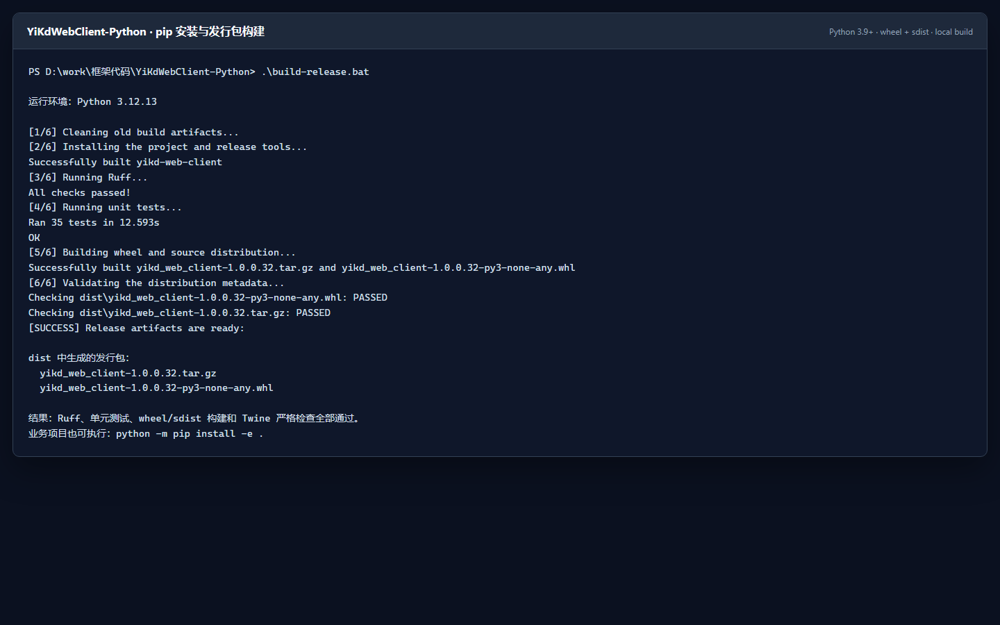

### 3.3 发行包名与导入名

| 用途 | 名称 |
| --- | --- |
| 安装/发行包名 | `yikd-web-client` |
| 推荐导入包名 | `yikd_web_client` |
| C#/Java 迁移兼容包名 | `YiKdWebClient` |

新代码推荐：

```python
from yikd_web_client import AppSettingsModel, LoginType, YiK3CloudClient
```

迁移已有 C#/Java 示例时，也可以使用兼容命名空间：

```python
from YiKdWebClient import YiK3CloudClient
from YiKdWebClient.Model import AppSettingsModel, LoginType
```

`YiKdWebClient.AuthService`、`CommonService`、`ComWebHelper`、`Model`、`SSO` 和 `ToolsHelper` 均提供对应重导出。兼容命名空间用于降低迁移成本，新项目仍推荐小写包名。

## 4. 配置 appsettings.xml

### 4.1 默认路径

客户端默认从进程当前工作目录读取：

```text
YiKdWebCfg/appsettings.xml
```

仓库只提交不含真实凭据的示例文件。第一次使用时在仓库根目录复制：

```powershell
Copy-Item .\YiKdWebCfg\appsettings.example.xml `
  .\YiKdWebCfg\appsettings.xml
```

`YiKdWebCfg/appsettings.xml`、`.cnf` 和本地环境变量文件已由 `.gitignore` 排除。仍应在提交前使用 `git status` 检查，避免通过其他文件名意外提交凭据。

### 4.2 完整配置示例

```xml
<?xml version="1.0" encoding="utf-8" ?>
<configuration>
  <appSettings>
    <!-- 数据中心 ID / 账套 ID -->
    <add key="X-KDApi-AcctID" value="your-account-id" />

    <!-- 第三方系统登录授权的应用 ID -->
    <add key="X-KDApi-AppID" value="your-app-id" />

    <!-- 第三方系统登录授权的应用密钥 -->
    <add key="X-KDApi-AppSec" value="your-app-secret" />

    <!-- 第三方系统登录授权中的集成用户 -->
    <add key="X-KDApi-UserName" value="your-user-name" />

    <!-- 账套语系，简体中文通常为 2052 -->
    <add key="X-KDApi-LCID" value="2052" />

    <!-- 私有云通常填写以 K3Cloud/ 结尾的地址 -->
    <add key="X-KDApi-ServerUrl" value="https://example.test/K3Cloud/" />

    <!-- 启用多组织时可填写组织编码 -->
    <add key="X-KDApi-OrgNum" value="" />
  </appSettings>
</configuration>
```

### 4.3 配置项说明

| 配置项 | 是否常用 | 说明 |
| --- | --- | --- |
| `X-KDApi-AcctID` | 是 | 数据中心 ID，也称账套 ID。 |
| `X-KDApi-UserName` | 是 | 第三方系统登录授权中的集成用户。 |
| `X-KDApi-AppID` | 是 | 第三方系统登录授权的应用 ID。 |
| `X-KDApi-AppSec` | 是 | 应用密钥；不要把生产密钥写入公开配置或日志。 |
| `X-KDApi-LCID` | 是 | 账套语系，简体中文通常为 `2052`。 |
| `X-KDApi-OrgNum` | 否 | 多组织场景中的组织编码，主要用于签名认证。 |
| `X-KDApi-ServerUrl` | 是 | 金蝶服务根地址；客户端会自动补末尾 `/`。 |

私有云与公有云网关的可用地址、认证要求可能随目标版本和部署方式不同。请以目标环境和金蝶官方最新要求为准，不要直接照搬示例域名。

### 4.4 自定义配置路径

最直接的方式是把路径传给模型：

```python
from yikd_web_client import AppSettingsModel

settings = AppSettingsModel(r"D:\configs\kingdee\appsettings.xml")
```

也可以在创建客户端前修改兼容的全局默认路径：

```python
from pathlib import Path

from yikd_web_client import XmlConfigHelper, YiK3CloudClient

XmlConfigHelper.AppConfigPath = Path(r"D:\configs\kingdee\appsettings.xml")
client = YiK3CloudClient()
```

必须先设置 `XmlConfigHelper.AppConfigPath`，再创建会读取默认配置的 `YiK3CloudClient` 或 `AppSettingsModel`。

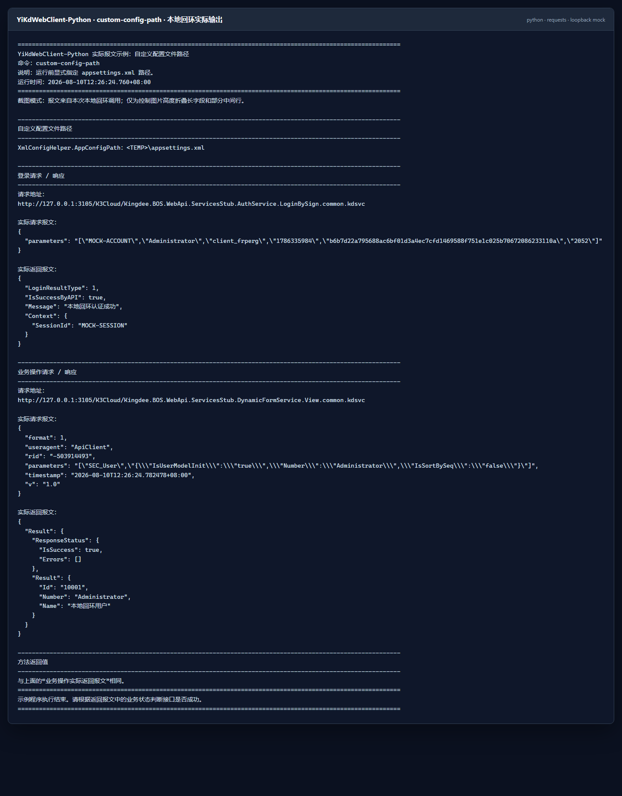

### 4.5 动态传入授权信息

配置来自环境变量、数据库、配置中心，或同一进程需要连接多个账套时，可以直接设置模型属性：

```python
import os

from yikd_web_client import AppSettingsModel, LoginType, YiK3CloudClient

settings = AppSettingsModel()
settings.XKDApiAcctID = os.environ["YIKD_ACCT_ID"]
settings.XKDApiUserName = os.environ["YIKD_USER_NAME"]
settings.XKDApiAppID = os.environ["YIKD_APP_ID"]
settings.XKDApiAppSec = os.environ["YIKD_APP_SECRET"]
settings.XKDApiLCID = "2052"
settings.XKDApiOrgNum = ""
settings.XKDApiServerUrl = os.environ["YIKD_SERVER_URL"]

client = YiK3CloudClient()
client.AppSettingsModel = settings
client.LoginType = LoginType.LoginBySignSHA256
```

同一属性也有 `account_id`、`username`、`app_id`、`app_secret`、`language_id`、`organization_number` 和 `server_url` 等 Python 风格别名。

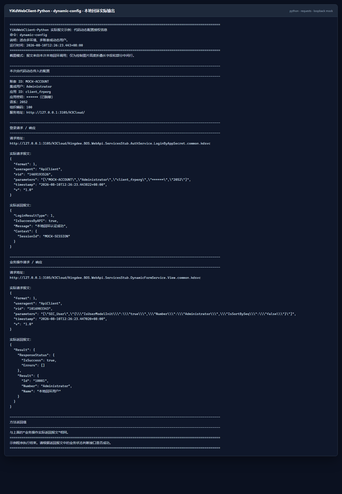

## 5. 五分钟运行第一个示例

1. 安装 Python 3.9 或更高版本，并确认 `python --version` 可用。
2. 在仓库根目录创建虚拟环境并执行 `python -m pip install -e .`。
3. 把 `appsettings.example.xml` 复制为 `appsettings.xml`，填写自己的测试环境授权信息。
4. 把示例中的表单和编号替换为目标环境真实存在、且当前集成用户有权查看的数据。
5. 运行：

   ```powershell
   python .\examples\basic.py
   ```

等价的完整代码如下。SHA256 签名信息认证是新接入时的推荐起点：

```python
from yikd_web_client import AppSettingsModel, LoginType, YiK3CloudClient

settings = AppSettingsModel("YiKdWebCfg/appsettings.xml")

with YiK3CloudClient() as client:
    client.AppSettingsModel = settings
    client.LoginType = LoginType.LoginBySignSHA256

    result_json = client.View(
        "BD_MATERIAL",
        '{"CreateOrgId":0,"Number":"PRE001"}',
    )

    print("登录地址：", client.ReturnLoginWebModel.RequestUrl)
    print("登录请求：", client.ReturnLoginWebModel.RealRequestBody)
    print("登录响应：", client.ReturnLoginWebModel.RealResponseBody)
    print("业务地址：", client.ReturnOperationWebModel.RequestUrl)
    print("业务请求：", client.ReturnOperationWebModel.RealRequestBody)
    print("业务响应：", client.ReturnOperationWebModel.RealResponseBody)
    print("View 返回值：", result_json)
```

HTTP 请求完成不代表业务一定成功。还要检查登录响应中的 `LoginResultType`，以及业务响应中的 `IsSuccessByAPI`、`ResponseStatus.IsSuccess`、`ErrorCode` 和 `Message`。输出真实请求前必须脱敏。

### 5.1 README 示例运行器

`examples/readme_runner.py` 把 README 中需要截图的场景整理成 13 个独立命令。它既可以连接自己的测试环境运行，也供截图生成脚本在本地回环环境中调用：

```powershell
python .\examples\readme_runner.py help
python .\examples\readme_runner.py sign-sha256
```

| 命令 | 场景 |
| --- | --- |
| `sign-sha256` | 签名信息认证（SHA256） |
| `sign-sha1` | 签名信息认证（SHA1） |
| `app-secret` | 第三方系统登录授权 |
| `validate-login` | 旧版用户名密码认证 |
| `simple-passport` | 集成密钥文件认证 |
| `api-sign-headers` | API 请求头签名认证 |
| `dynamic-config` | 代码动态配置授权信息 |
| `custom-config-path` | 自定义配置文件路径 |
| `custom-webapi` | 调用自定义 WebAPI |
| `sso-v4` | 单点登录 V4 |
| `upload-file` | 文件路径分块上传 |
| `upload-progress` | 文件分块上传及进度回调 |
| `upload-base64` | Base64 流分块上传 |

运行器默认读取本仓库配置；也可以用 `YIKD_CONFIG_PATH`、`YIKD_CNF_PATH`、`YIKD_SERVER_URL`、`YIKD_UPLOAD_FILE` 和其他 `YIKD_*` 环境变量覆盖。`validate-login` 必须显式设置 `YIKD_VALIDATE_PASSWORD`。

### 5.2 截图说明

本 README 的 14 张 Python 截图由上述运行器实际执行后生成。为避免依赖作者账套或泄露凭据，生成脚本会启动仅监听 `127.0.0.1` 的临时 HTTP 服务，并使用 `MOCK-*` 占位配置：

- 登录、业务调用、API 请求头签名、自定义 WebAPI 和附件分块都会真实经过 Python HTTP 传输层；
- SSO V4 按真实 Python 算法在本地生成签名参数和入口 URL，本来就不发送 HTTP 请求；
- 密码和应用密钥在运行器输出与截图脚本两层替换为 `******`；
- 截图模式只折叠超长字段和部分中间行，直接运行同一命令可查看完整报文；
- 临时配置、`.cnf`、上传文件、HTTP 服务和渲染 HTML 会在脚本退出时清理。

截图里的内容与客户端属性对应如下：

| 截图内容 | Python 属性或变量 |
| --- | --- |
| 登录地址、请求、响应 | `ReturnLoginWebModel.RequestUrl`、`RealRequestBody`、`RealResponseBody` |
| 业务地址、请求、响应 | `ReturnOperationWebModel.RequestUrl`、`RealRequestBody`、`RealResponseBody` |
| API 签名请求头 | `RequestHeadersString`、`RequestHeaders` |
| 方法返回值 | `View`、`CustomBusinessServiceByParameters` 或附件工具的返回字符串 |
| SSO 参数与入口 | `SSOHelper.argJosn`、`argJsonBase64`、`SSOLoginUrlObject` |
| 上传进度 | 回调参数 `FileChunk` 与当前 `YiK3CloudClient` |

## 6. 登录验证方式与完整示例

### 6.1 认证模式总览

Python 版与 C#/Java `LoginType` 保持一致，共有 7 个枚举值：6 种可选认证模式，以及 1 种仅为旧系统保留的兼容模式。

| `LoginType` | 用途 | 是否先登录 |
| --- | --- | --- |
| `LoginBySignSHA256` | SHA256 签名信息认证，推荐优先验证 | 是 |
| `LoginBySignSHA1` | SHA1 签名信息认证，兼容旧补丁 | 是 |
| `LoginByAppSecret` | 第三方系统登录授权 | 是 |
| `LoginByApiSignHeaders` | 每个业务请求独立生成 API 签名请求头 | 否 |
| `ValidateLogin` | 旧版用户名密码认证 | 是 |
| `LoginBySimplePassport` | 集成密钥文件或预先读取的 Base64 | 是 |
| `ValidateUserEnDeCode` | 已弃用的旧式用户名密码编码兼容 | 是 |

“7 个枚举值”不等于 7 种推荐方案。新项目通常从 `LoginBySignSHA256`、`LoginByAppSecret` 或目标网关要求的 `LoginByApiSignHeaders` 中选择。

### 6.2 SHA256 签名信息认证（推荐）

```python
from yikd_web_client import AppSettingsModel, LoginType, YiK3CloudClient

client = YiK3CloudClient()
client.AppSettingsModel = AppSettingsModel("YiKdWebCfg/appsettings.xml")
client.LoginType = LoginType.LoginBySignSHA256

result_json = client.View("SEC_User", '{"Number":"Administrator"}')
print(result_json)
```

签名使用账套 ID、集成用户、应用 ID、应用密钥、时间戳及可选组织编码。签名失败时，除核对配置外，还要确认客户端与服务器时间没有明显偏差。

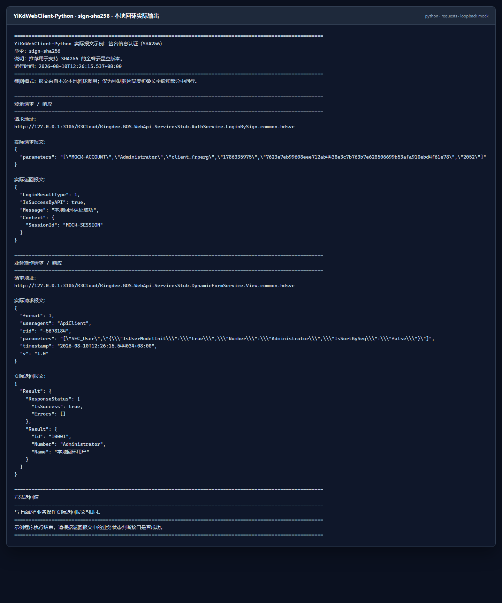

### 6.3 SHA1 签名信息认证（旧版本兼容）

配置和调用方式与 SHA256 相同，只替换枚举：

```python
client.LoginType = LoginType.LoginBySignSHA1
```

除非目标补丁明确要求 SHA1，新接入优先使用 SHA256。

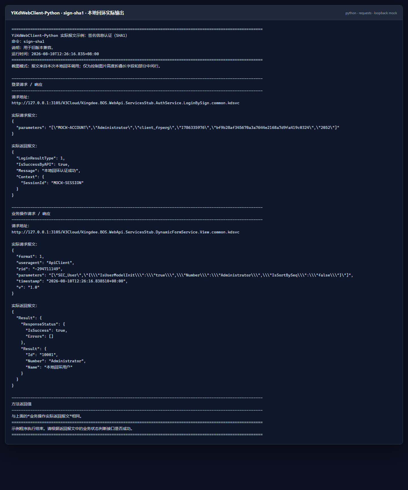

### 6.4 第三方系统登录授权

```python
client.AppSettingsModel = AppSettingsModel("YiKdWebCfg/appsettings.xml")
client.LoginType = LoginType.LoginByAppSecret

result_json = client.View("SEC_User", '{"Number":"Administrator"}')
```

`YiK3CloudClient` 的初始 `LoginType` 是 `LoginByAppSecret`，但示例和生产代码仍建议显式赋值，便于审查实际使用的认证模式。

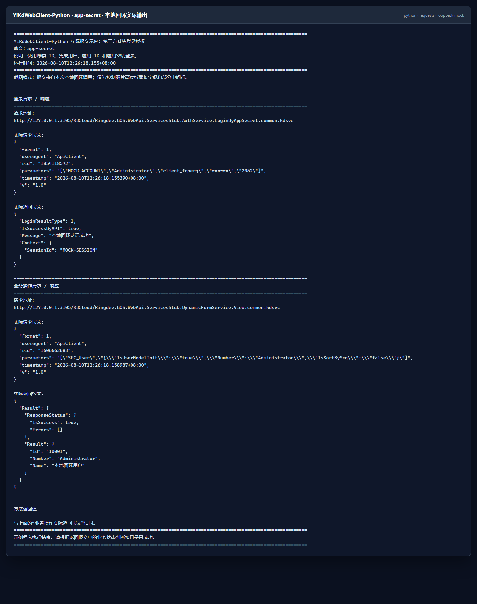

### 6.5 API 请求头签名认证

该模式不发送独立登录请求，而是在每个业务请求中生成签名请求头，因此 `ReturnLoginWebModel` 没有登录报文：

```python
from yikd_web_client import AppSettingsModel, LoginType, YiK3CloudClient

client = YiK3CloudClient()
client.AppSettingsModel = AppSettingsModel("YiKdWebCfg/appsettings.xml")
client.LoginType = LoginType.LoginByApiSignHeaders

result_json = client.ExecuteBillQuery(
    '{"FormId":"BD_MATERIAL",'
    '"FieldKeys":"FNumber,FName",'
    '"FilterString":"",'
    '"OrderString":"",'
    '"TopRowCount":0,'
    '"StartRow":0,'
    '"Limit":10}'
)

print(client.RequestHeadersString)
print(client.ReturnOperationWebModel.RealRequestBody)
print(result_json)
```

生产使用前应确认目标金蝶版本、网关和授权页面仍支持对应算法及请求头格式。

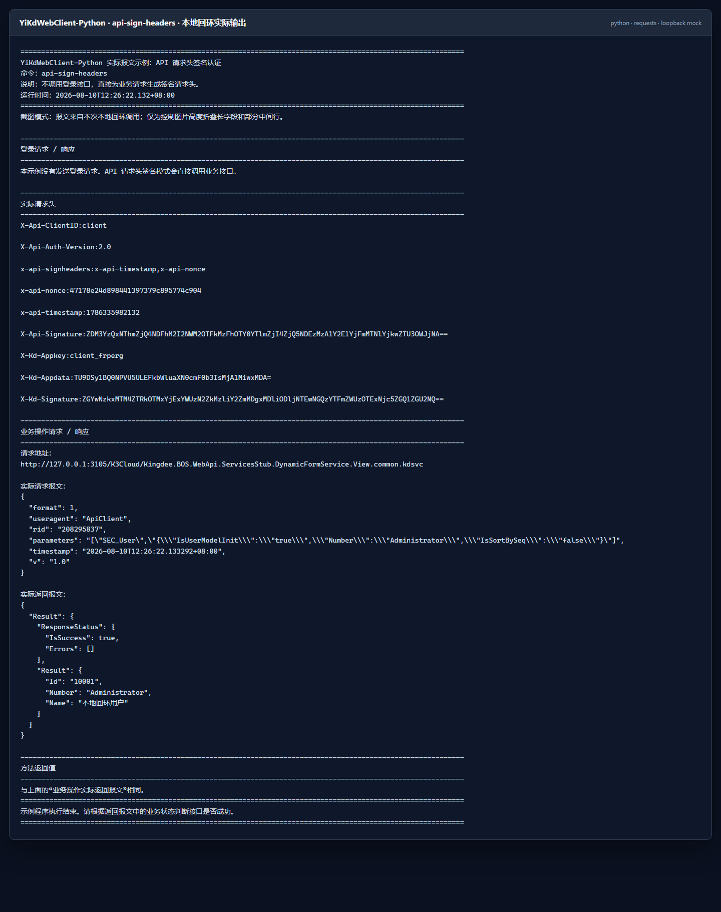

### 6.6 旧版用户名密码认证

不要把密码写入源码或 XML 示例。下面只从环境变量读取：

```python
import os

from yikd_web_client import (
    LoginType,
    ValidateLoginSettingsModel,
    YiK3CloudClient,
)

client = YiK3CloudClient()
client.LoginType = LoginType.ValidateLogin
client.validateLoginSettingsModel = ValidateLoginSettingsModel(
    "https://example.test/K3Cloud/",
    DbId="account-id",
    UserName="Administrator",
    Password=os.environ["YIKD_VALIDATE_PASSWORD"],
    lcid=2052,
)

result_json = client.View("SEC_User", '{"Number":"Administrator"}')
print(result_json)
```

PowerShell 临时设置和清理环境变量：

```powershell
$env:YIKD_VALIDATE_PASSWORD = '<替换为测试环境密码>'
python .\your_validate_login_example.py
Remove-Item Env:\YIKD_VALIDATE_PASSWORD
```

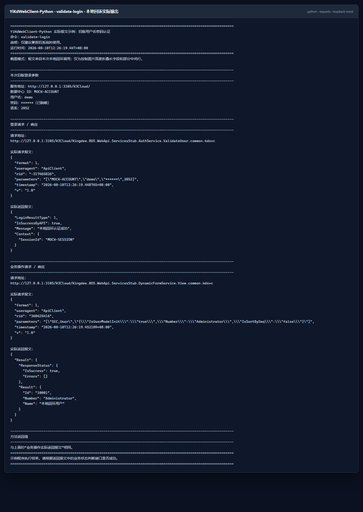

### 6.7 集成密钥认证（文件或 Base64）

`.cnf` 必须由目标金蝶环境生成，并与服务地址和数据中心匹配。文件方式：

```python
from yikd_web_client import (
    BySimplePassportType,
    LoginBySimplePassportModel,
    LoginType,
    YiK3CloudClient,
)

client = YiK3CloudClient()
client.LoginType = LoginType.LoginBySimplePassport
client.LoginBySimplePassportModel = LoginBySimplePassportModel(
    "https://example.test/K3Cloud/",
    CnfFilePath=r"D:\configs\kingdee\API测试.cnf",
    Lcid=2052,
    bySimplePassportType=BySimplePassportType.CnfFile,
)

result_json = client.View("SEC_User", '{"Number":"Administrator"}')
print(result_json)
```

如果集成密钥已从安全存储读取为 Base64，不必落地 `.cnf` 文件：

```python
client.LoginBySimplePassportModel = LoginBySimplePassportModel(
    "https://example.test/K3Cloud/",
    SimplePassportForBase64=base64_passport_from_secure_store,
    Lcid=2052,
    bySimplePassportType=BySimplePassportType.ForBase64,
)
```

文件和 Base64 是同一个 `LoginBySimplePassport` 的两种密钥来源，不额外计为两个 `LoginType`。

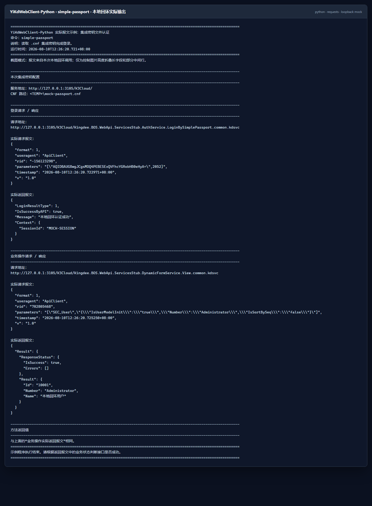

### 6.8 已弃用的 ValidateUserEnDeCode

`ValidateUserEnDeCode` 会对用户名和密码执行旧式 DES 兼容编码，并调用对应旧服务。它仅用于兼容历史场景，新项目不要选择此模式。

如维护旧系统，可复用 6.6 的 `ValidateLoginSettingsModel`，仅把枚举改为：

```python
client.LoginType = LoginType.ValidateUserEnDeCode
```

### 6.9 查看真实请求和响应

| 属性 | 内容 |
| --- | --- |
| `ReturnLoginWebModel.RequestUrl` | 实际登录地址 |
| `ReturnLoginWebModel.RealRequestBody` | 实际登录请求体 |
| `ReturnLoginWebModel.RealResponseBody` | 实际登录响应体 |
| `ReturnOperationWebModel.RequestUrl` | 实际业务地址 |
| `ReturnOperationWebModel.RealRequestBody` | 实际业务请求体 |
| `ReturnOperationWebModel.RealResponseBody` | 实际业务响应体 |
| `RequestHeadersString` | API 请求头签名模式生成的请求头 |

这些属性是排查请求包装、服务路径和业务参数最直接的依据，但也最可能包含敏感信息。复制到工单、聊天或 Postman 前必须脱敏。

## 7. JSON 参数、常用接口与会话复用

### 7.1 JSON 参数

大多数动态表单方法接收 JSON **字符串**，内容与金蝶官方业务参数要求一致，客户端负责包装外层 HTTP 报文：

```python
form_id = "SEC_User"
json_data = (
    '{"IsUserModelInit":"true",'
    '"Number":"Administrator",'
    '"IsSortBySeq":"false"}'
)

result_json = client.View(form_id, json_data)
```

方法返回值也是原始 JSON 字符串。需要读取字段时由业务代码显式解析：

```python
import json

result = json.loads(result_json)
```

### 7.2 常用接口

| 方法 | 用途 |
| --- | --- |
| `View` | 查看单据或基础资料 |
| `Save`、`BatchSave`、`Draft`、`GroupSave`、`FlexSave` | 保存、批量保存、暂存、分组保存、弹性域保存 |
| `Submit`、`Audit`、`UnAudit`、`Delete`、`GroupDelete` | 提交、审核、反审核、删除 |
| `ExecuteOperation`、`Push`、`Allocate`、`CancelAllocate`、`CancelAssign`、`Disassembly` | 操作、下推、分配、撤销和拆单 |
| `ExecuteBillQuery`、`GetSysReportData`、`QueryBusinessInfo`、`QueryGroupInfo` | 单据查询、报表和业务信息查询 |
| `SendMsg`、`SwitchOrg`、`WorkflowAudit` | 消息、组织切换和工作流审批 |
| `AttachmentUpLoad`、`AttachmentDownLoad`、`UploadFile` | 原始附件/文件服务接口 |
| `CustomBusinessService`、`CustomBusinessServiceByParameters` | 自定义 WebAPI |
| `GetDataCenterList` | 获取数据中心列表 |

完整方法、参数顺序、Python 别名和服务路径见 [API 对照文档](docs/API_MAPPING.md)。`ExecuteOperation` 的参数顺序与当前 C#/Java 基准一致：

```python
client.ExecuteOperation(form_id, operation_number, json_data)
```

### 7.3 自动登录、自动登出与会话复用

大部分业务方法的最后两个参数是：

```python
client.View(form_id, json_data)                    # 自动登录、自动登出
client.View(form_id, json_data, AutoLogin=False)   # 不再登录，调用后仍自动登出
client.View(
    form_id,
    json_data,
    AutoLogin=False,
    AutoLogout=False,
)                                                   # 复用现有会话
```

连续调用多个接口时，可以复用同一 Cookie：

```python
from yikd_web_client import AppSettingsModel, LoginType, YiK3CloudClient

with YiK3CloudClient() as client:
    client.AppSettingsModel = AppSettingsModel("YiKdWebCfg/appsettings.xml")
    client.LoginType = LoginType.LoginBySignSHA256
    client.Login()

    try:
        user_json = client.View(
            "SEC_User",
            '{"Number":"Administrator"}',
            AutoLogin=False,
            AutoLogout=False,
        )
        material_json = client.ExecuteBillQuery(
            '{"FormId":"BD_MATERIAL",'
            '"FieldKeys":"FNumber,FName",'
            '"Limit":10}',
            AutoLogin=False,
            AutoLogout=False,
        )
        print(user_json)
        print(material_json)
    finally:
        client.Logout()
```

`close()`、`Dispose()` 和退出 `with` 只释放本地客户端状态，不代替 HTTP `Logout()`。客户端包含可变 Cookie、请求头和最近请求状态，不要让多个线程或协程并发共享同一个实例。

## 8. 单点登录

项目支持 SSO V1、V2、V3 和 V4。下面生成 V4 的 HTML5、Silverlight 和 WPF 入口；生成 URL 本身不会发送 HTTP 请求：

```python
from yikd_web_client import AppSettingsModel, SSOHelper

settings = AppSettingsModel("YiKdWebCfg/appsettings.xml")

helper = SSOHelper()
helper.appSettingsModel = settings
helper.Url = settings.XKDApiServerUrl
helper.permitcount = "1"

urls = helper.GetSsoUrlsV4(settings.XKDApiUserName)

print("签名参数：", helper.argJosn)
print("Base64 参数：", helper.argJsonBase64)
print("HTML5：", urls.html5Url)
print("Silverlight：", urls.silverlightUrl)
print("WPF：", urls.wpfUrl)

# 旧版本按目标环境选择：
# helper.GetSsoUrlsV3(settings.XKDApiUserName)
# helper.GetSsoUrlsV2(settings.XKDApiUserName)
# helper.GetSsoUrlsV1(settings.XKDApiUserName)
```

构造并执行 SSO V4 登出：

```python
logout_request = helper.GetSSOLogoutap0StrV4(settings.XKDApiUserName)
logout_response = helper.SSOExcuteLogout(logout_request)
print(logout_response)
```

V3、V2/V1 分别使用 `GetSSOLogoutap0StrV3` 和 `GetSSOLogoutap0StrV2V1`。SSO URL 和签名参数属于敏感登录材料，不应写入公开日志。

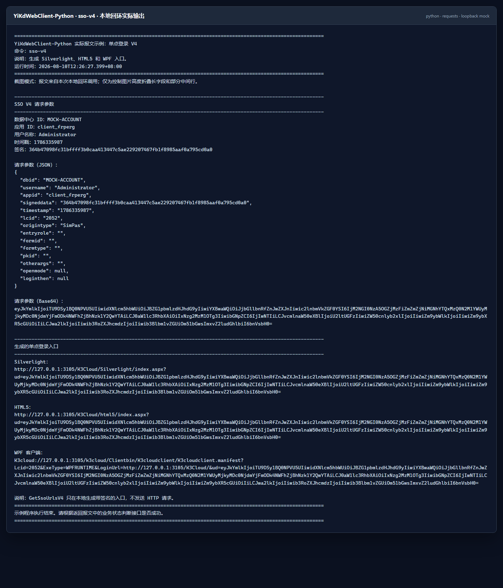

## 9. 自定义 WebAPI

官方自定义 WebAPI 报文格式与参数说明：<https://vip.kingdee.com/article/97030089581136896?specialId=448928749460099072&productLineId=1&isKnowledge=2&lang=zh-CN>

目标金蝶环境必须先部署服务端自定义 WebAPI。Python 仓库只移植客户端；C# 仓库中的 `GlobalServiceCustom.WebApi` 才是需要部署到金蝶/.NET 服务端的示例项目。

```python
from yikd_web_client import CustomServicesStubpath

service = CustomServicesStubpath(
    ProjetNamespace="GlobalServiceCustom.WebApi",
    ProjetClassName="DataServiceHandler",
    ProjetClassMethod="CommonRunnerService",
)

# 使用标准 YiKdWebClient 外层参数包装。
result_json = client.CustomBusinessService(
    '{"value":1}',
    service,
)

# 原样发送已经准备好的完整参数 JSON。
raw_result_json = client.CustomBusinessServiceByParameters(
    '["one",2]',
    service,
)
```

也可以直接传服务路径字符串；缺少 `.common.kdsvc` 后缀时客户端会自动补齐。命名空间、类名、公开方法名和程序集命名必须与服务器端部署内容完全一致。

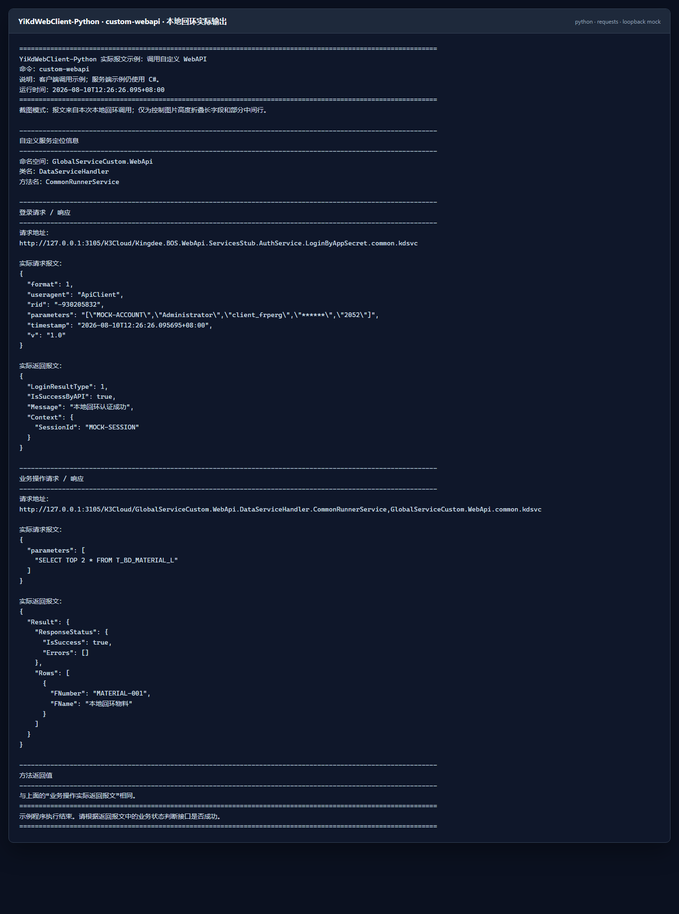

## 10. 文件分块上传

官方附件上传报文结构与原理：<https://vip.kingdee.com/article/296577252589190400?productLineId=1&isKnowledge=2&lang=zh-CN>

附件上传会写入目标业务系统。接入前必须替换真实表单 ID、单据内码和单据编号，并确认目标环境已经配置附件或对象存储。

### 10.1 文件路径上传并获取进度

```python
from yikd_web_client import (
    AttachmentHelper,
    UploadModel,
    UploadModelData,
)

upload = UploadModel(
    data=UploadModelData(
        FormId="SAL_SaleOrder",
        InterId="100020",
        BillNO="XSDD000019",
        Entrykey="",
        EntryinterId="-1",
    )
)


def report_progress(chunk, current_client):
    print(
        f"已完成分块 {chunk.Chunkindex + 1}，"
        f"文件 {chunk.Filename}，最后一块：{chunk.IsLast}"
    )


result_json = AttachmentHelper.AttachmentUploadByFilePath(
    r"D:\files\upload-demo.txt",
    client,
    upload,
    chunkSize=2 * 1024 * 1024,
    progressaction=report_progress,
)

print(result_json)
print("服务端文件 ID：", upload.data.FileId)
```

不需要进度时可省略 `progressaction`。每个成功分块返回的 `FileId` 会写回 `upload.data.FileId`，供后续分块继续使用。

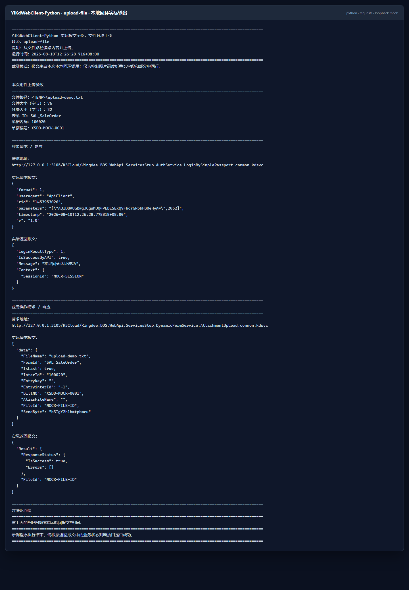

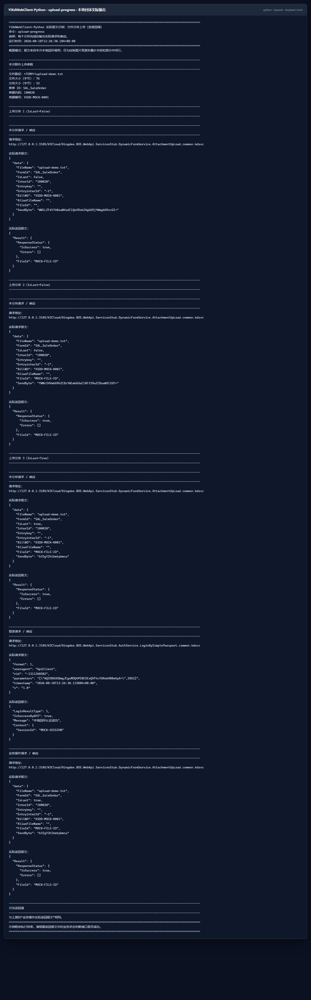

### 10.2 Base64 分块上传

已经持有 Base64 文件内容时，不必先还原成临时文件：

```python
result_json = AttachmentHelper.AttachmentUploadByBase64(
    base64_data,
    "upload-demo.txt",
    client,
    upload,
    chunkSize=2 * 1024 * 1024,
    progressaction=report_progress,
)
```

默认分块大小是 1 MiB。实际可用大小还应服从目标金蝶版本、反向代理和附件存储限制。


## 11. HTTP 工具与异步边界

`WebHelperServices` 对应主客户端使用的 JSON HTTP 工具；`WebHelper` 支持 query、raw、URL encoded 和 multipart/form-data 请求。

| 工具 | 主要用途 |
| --- | --- |
| `WebHelperServices` | JSON 请求、请求头、Cookie、同步/异步发送 |
| `WebHelper` | 通用 HTTP 方法与多种请求体 |
| `MultipartFormData` | 组合 multipart 字段和文件 |
| `BodyType` | `none`、`raw`、`urlencoded`、`formdata` |
| `HttpMethod` | GET、POST、PUT、PATCH、DELETE 等 |

同步调用：

```python
from yikd_web_client import WebHelperServices

helper = WebHelperServices()
helper.Timeout = 30
response_text = helper.SendHttpRequest(url, json_text)
```

异步调用：

```python
import asyncio

from yikd_web_client import WebHelperServices


async def main():
    helper = WebHelperServices()
    helper.Timeout = 30
    response_text = await helper.SendHttpRequestAsync(url, json_text)
    print(response_text)


asyncio.run(main())
```

异步方法通过 `asyncio.to_thread` 调度同一个同步请求实现，适合避免阻塞事件循环，但不是独立的异步 HTTP 协议栈。`YiK3CloudClient` 的登录、动态表单、SSO 登出和附件上传仍是同步 API；并发业务调用应为每个任务创建独立客户端实例。

## 12. C#、Java 与 Python 使用差异

| 对照项 | C# | Java | Python |
| --- | --- | --- | --- |
| 获取方式 | NuGet | Maven 本地仓库、Gradle `mavenLocal()` 或发行 JAR | 源码可编辑安装或本地 wheel；PyPI 首次发布后再使用在线安装 |
| 资源释放 | `using` / `Dispose()` | `try (...)` / `close()` | `with` / `close()` |
| Cookie | `CookieContainer` | `java.net.CookieManager` | `requests.cookies.RequestsCookieJar` |
| 超时 | `TimeSpan` | `java.time.Duration` | 主客户端使用秒数；底层传输也接受 `timedelta` |
| 集合 | `Dictionary<K,V>` | `Map<K,V>` | `dict` |
| 回调 | `Action<T>` / `Action<T1,T2>` | `Consumer<T>` / `BiConsumer<T1,T2>` | `Callable` |
| JSON | `System.Text.Json` | Jackson 2.x | Python 标准库 `json` |
| 公开方法名 | PascalCase | PascalCase | 兼容 PascalCase，同时提供常用 `snake_case` |
| 运行时 | .NET 多目标框架 | Java 8 字节码，可运行于较新 JDK | Python 3.9～3.13 |
| 异步边界 | 依具体 HTTP 工具 | 公开业务客户端为同步调用 | 公开业务客户端为同步调用，底层 HTTP 工具有异步包装 |

三个版本使用相同的 `appsettings.xml` 键名、认证枚举含义、动态表单方法名、参数顺序和服务路径。Python 迁移时可以先保留原方法名：

```python
result_json = client.View("BD_MATERIAL", '{"Number":"PRE001"}')
```

再按项目风格逐步改成等价别名：

```python
result_json = client.view("BD_MATERIAL", '{"Number":"PRE001"}')
```

完整映射和已验证边界见 [docs/API_MAPPING.md](docs/API_MAPPING.md)。目标金蝶版本、补丁、许可、公私有云网关及自定义服务 DLL 仍需在使用者自己的环境中做最终集成验证。

## 13. 常见问题

### 13.1 找不到 YiKdWebCfg/appsettings.xml

默认路径相对于**进程当前工作目录**，不一定相对于调用脚本所在目录。先检查：

```python
from pathlib import Path

print(Path.cwd())
print(Path("YiKdWebCfg/appsettings.xml").resolve())
```

也可以直接把绝对路径传给 `AppSettingsModel`。为兼容原项目，配置文件缺失或 XML 无效时会保留空字段，而不是立即抛错；因此登录失败时要先核对实际读取路径和各字段值。

### 13.2 出现 ModuleNotFoundError: yikd_web_client

确认安装命令与运行命令使用同一个 Python：

```powershell
python -c "import sys; print(sys.executable)"
python -m pip install -e .
python -c "import yikd_web_client; print(yikd_web_client.__version__)"
```

不要只运行来自另一个解释器的裸 `pip`。

### 13.3 出现 ModuleNotFoundError: Crypto

安装声明依赖即可：

```powershell
python -m pip install -e .
```

正确依赖名是 `pycryptodome`，导入命名空间是 `Crypto`。不要用长期无人维护的 `pycrypto` 替代，也不要安装名称相似但无关的 `crypto` 包。

### 13.4 返回登录失败

依次检查：

1. 服务地址与数据中心是否匹配；
2. 集成用户是否在第三方系统登录授权范围内；
3. 应用 ID 与应用密钥是否成对；
4. 语系和组织编码是否适用；
5. 客户端和服务器时间是否准确；
6. `LoginBySimplePassport` 的 `.cnf` 是否来自同一目标环境；
7. 旧版登录是否正确、安全地提供了密码；
8. 实际读取的配置文件是不是预期文件。

### 13.5 登录成功但业务调用失败

继续检查 `ResponseStatus`、用户权限、表单 ID、字段名、单据状态和组织范围。查看 `ReturnOperationWebModel`，把实际 URL、请求头和请求体脱敏后复制到 Postman/ApiPost 对比，可以区分客户端参数问题与服务端业务规则问题。

### 13.6 API 请求头模式没有登录报文

这是设计行为。`LoginByApiSignHeaders` 不调用独立登录接口，认证信息位于 `RequestHeadersString` 和实际业务请求头中。

### 13.7 .cnf 集成密钥无法使用

`.cnf` 必须由目标环境生成，并与服务地址和数据中心匹配。复制其他环境的文件通常无法登录。也可以把内容安全读取为 Base64，使用 `BySimplePassportType.ForBase64`，避免在运行环境落地文件。

### 13.8 上传返回存储配置错误

这通常表示请求已到达附件接口，但服务端没有正确配置附件/对象存储，或示例中的表单、单据内码和编号不存在。先完成服务端配置，再替换为真实参数。

### 13.9 为什么有些失败返回字符串而不是抛异常

为保持 C#/Java 移植行为，部分高层业务方法会捕获登录、网络或报文错误，并把错误文本作为返回字符串。业务代码不能只凭“函数返回了字符串”判断成功，应解析 JSON 并检查登录结果和 `ResponseStatus`；同时结合 `ReturnLoginWebModel`、`ReturnOperationWebModel` 排查。

### 13.10 with 会自动退出金蝶登录吗

不会。退出 `with` 等价于本地 `Dispose()`，用于释放客户端状态；它不代替 HTTP `Logout()`。单次业务方法默认会自动登录和登出，手动复用会话时应在 `finally` 中显式调用 `Logout()`。

## 14. 开发、测试与发布构建

安装开发依赖：

```powershell
python -m pip install -e ".[dev]"
```

代码检查和全部单元测试：

```powershell
python -m ruff check src tests examples
python -m unittest discover -s tests -v
```

测试使用本机环回 HTTP 服务，不需要真实账套、真实密钥或外部金蝶环境，也不会写入业务系统。

手工构建与检查发行包：

```powershell
python -m build
python -m twine check --strict dist\*
```

Windows 也可以一次执行完整发布前检查：

```powershell
.\build-release.bat
```

修改公开方法、参数顺序、认证报文或服务路径时，请同步更新测试和 [docs/API_MAPPING.md](docs/API_MAPPING.md)。更多约定见 [CONTRIBUTING.md](CONTRIBUTING.md)、[SECURITY.md](SECURITY.md) 和 [CHANGELOG.md](CHANGELOG.md)。

## 15. 重新生成 README 截图

截图统一存放在 `docs/screenshots`，生成脚本为 `docs/generate-readme-screenshots.ps1`。脚本会：

1. 运行 `build-release.bat`，执行 Ruff、单元测试、wheel/sdist 构建和 Twine 检查；
2. 生成 `00-pip-install.png`；
3. 在随机本地端口启动只监听 `127.0.0.1` 的临时回环 HTTP 服务；
4. 创建临时占位 XML、`.cnf` 和上传文件；
5. 依次真实运行 13 个 Python 示例，并使用 Microsoft Edge 无头模式生成 PNG；
6. 恢复进程环境变量，停止回环服务并删除全部临时文件。

完整重新构建并截图：

```powershell
powershell -NoProfile -ExecutionPolicy Bypass `
  -File .\docs\generate-readme-screenshots.ps1
```

已经完成发布构建，只想重新运行示例和渲染图片时：

```powershell
powershell -NoProfile -ExecutionPolicy Bypass `
  -File .\docs\generate-readme-screenshots.ps1 -SkipBuild
```

截图脚本不需要真实金蝶地址、真实密码或真实密钥，也不会连接或写入业务系统。要验证目标环境，请按第 4 节准备自己的测试配置，再直接运行 `examples/readme_runner.py` 中的对应命令。

## 16. Git 双远程与项目地址

本地 `origin` 默认从 Gitee 拉取，普通 `git push` 会依次推送到 Gitee 与 GitHub：

```text
fetch: https://gitee.com/lnsyzjw/yi-kd-web-client-python.git
push:  https://gitee.com/lnsyzjw/yi-kd-web-client-python.git
push:  https://github.com/1609676823/YiKdWebClient-Python.git
```

在新的克隆目录中运行一次脚本即可恢复相同配置：

```powershell
powershell -NoProfile -ExecutionPolicy Bypass `
  -File .\scripts\configure-remotes.ps1
```

脚本会将当前分支的拉取上游设为 Gitee，并重建两个 `pushurl`；可重复执行，不会累积重复地址。使用 `git remote -v` 可随时复核。

项目地址：

- Python Gitee：<https://gitee.com/lnsyzjw/yi-kd-web-client-python>
- Python GitHub：<https://github.com/1609676823/YiKdWebClient-Python>
- C# Gitee：<https://gitee.com/lnsyzjw/yi-kd-web-client>
- C# GitHub：<https://github.com/1609676823/YiKdWebClient>
- C# NuGet：<https://www.nuget.org/packages/YiKdWebClient>
- Java Gitee：<https://gitee.com/lnsyzjw/yi-kd-web-client-java>
- Java GitHub：<https://github.com/1609676823/YiKdWebClient-Java>

本项目采用 [MIT License](LICENSE)。你可以在保留版权和许可声明的前提下使用、复制、修改、合并、发布、分发、再许可和销售本软件。软件按“原样”提供，不附带任何明示或默示担保。
