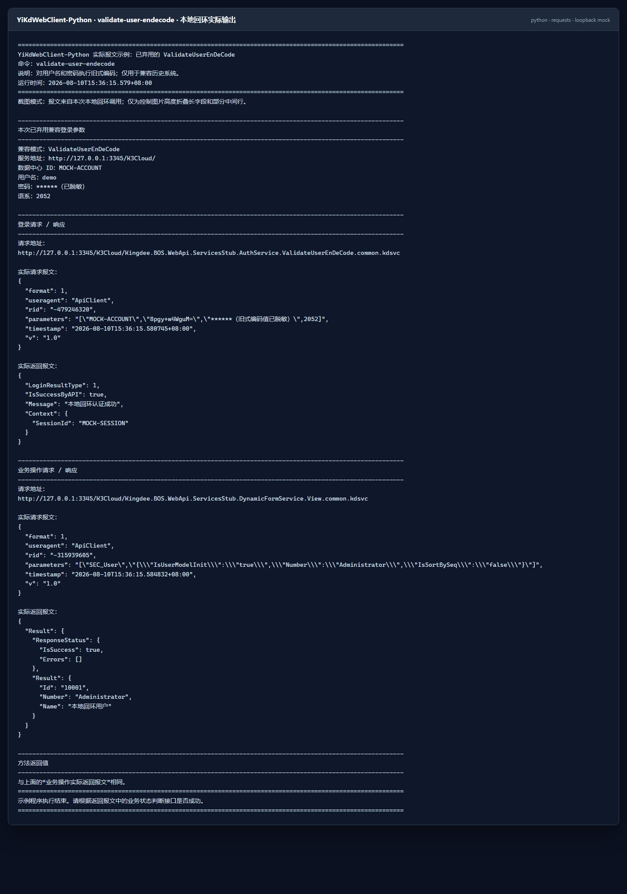

# YiKdWebClient-Python

## YiKdWebClient 多语言项目

YiKdWebClient 是一个面向 **金蝶云星空 WebAPI** 的多语言开源客户端项目。各语言版本尽量保持一致的认证方式、公开方法名、参数顺序、服务路径和调用体验，方便不同技术栈对照接入。

当前项目提供 **C#、Java、Python、Go、PHP 和 HTTP (JSON)** 六种接入方式，均已完成适配。各版本使用独立仓库，并同时维护 Gitee 和 GitHub 地址。HTTP (JSON) 是不限定编程语言的通用接入版本；后续公共功能、协议报文和通用接入说明统一以其仓库 README 为准，各语言版本 README 主要维护安装、依赖、命名、异常/错误处理和同步/异步等语言特性。

| 接入版本 | 适配状态 | 当前基准 | Gitee | GitHub |
| --- | --- | --- | --- | --- |
| C# | 已适配 | `1.0.0.32` | [YiKdWebClient C#](https://gitee.com/lnsyzjw/yi-kd-web-client) | [YiKdWebClient C#](https://github.com/1609676823/YiKdWebClient) |
| Java | 已适配 | 对标 C# `1.0.0.32` | [YiKdWebClient Java](https://gitee.com/lnsyzjw/yi-kd-web-client-java) | [YiKdWebClient Java](https://github.com/1609676823/YiKdWebClient-Java) |
| Python | 已适配，当前项目 | 对标 C# `1.0.0.32` | [YiKdWebClient Python](https://gitee.com/lnsyzjw/yi-kd-web-client-python) | [YiKdWebClient Python](https://github.com/1609676823/YiKdWebClient-Python) |
| Go | 已适配 | Go `v1.0.0`，对标 C# `1.0.0.32` | [YiKdWebClient Go](https://gitee.com/lnsyzjw/yi-kd-web-client-go) | [YiKdWebClient Go](https://github.com/1609676823/YiKdWebClient-Go) |
| PHP | 已适配 | 对标 C# `1.0.0.32` | [YiKdWebClient PHP](https://gitee.com/lnsyzjw/yi-kd-web-client-php) | [YiKdWebClient PHP](https://github.com/1609676823/YiKdWebClient-PHP) |
| HTTP (JSON) | 已适配，通用接入 | 以 HTTP (JSON) 仓库 README 为准 | [YiKdWebClient HTTP](https://gitee.com/lnsyzjw/yi-kd-web-client-http) | [YiKdWebClient HTTP](https://github.com/1609676823/YiKdWebClient-HTTP) |

### 当前仓库

YiKdWebClient-Python 是 C# `YiKdWebClient` `1.0.0.32` 的 Python 移植版，并参考 Java 版交叉核对认证报文和跨语言行为。它提供 C#/Java 兼容命名空间和 PascalCase API，同时提供常用 Python `snake_case` 别名和 `py.typed` 类型标记；高层业务 API 保持同步调用，底层 HTTP 工具提供明确的同步/异步边界。

### 共同功能范围

所有已适配语言版本共同覆盖：

- 7 个认证枚举：SHA256 签名、SHA1 签名、第三方系统登录授权、API 请求头签名、旧版用户名密码、集成密钥/CNF，以及仅为兼容旧系统保留的 `ValidateUserEnDeCode`；
- 查看、保存、批量保存、提交、审核、反审核、删除、查询、下推、分配等动态表单 WebAPI；
- 默认自动登录/登出、可选手动会话复用和 Cookie 管理；
- 单点登录 SSO V1～V4、SSO 登出参数与登出请求；
- 自定义 WebAPI 服务路径组装和调用；
- 文件路径与 Base64 附件分块上传、分块进度和最终返回；
- 默认 XML 配置、自定义配置路径和运行时动态传入授权信息；
- 登录与业务请求的实际 URL、请求头、请求体和响应体，便于使用 Postman、ApiPost 等工具排查问题。

> [!WARNING]
> 配置模板、mock 输出或本地测试截图只用于演示。接入自己的环境时，必须替换数据中心 ID、集成用户、应用 ID、应用密钥、服务地址和集成密钥文件。请勿把生产密钥、生产密码、CNF、Cookie 或长期有效的会话信息提交到公开仓库。

> [!IMPORTANT]
> 旧版用户名密码认证只用于协议兼容。独立代码示例会直接定义认证变量，并使用 `123456` 等明确占位值；每个占位值旁均注明需要替换为目标环境的真实值。示例会完整输出登录请求报文，便于直接复制、运行和排查。

> [!NOTE]
> 部分代码、测试、文档、示例或其他项目内容，可能在维护者指导和审查下借助 AI 工具生成、补全、重构或校对。AI 辅助内容在合并或发布前仍会由维护者进行审查和必要验证；使用者也应结合实际金蝶版本、补丁、权限和业务数据，自行评估正确性、安全性与适用性。

## 目录

- [1. 相关资料](#1-相关资料)
- [2. Python 环境与依赖](#2-python-环境与依赖)
- [3. 安装、构建与导入](#3-安装构建与导入)
- [4. 配置 appsettings.xml](#4-配置-appsettingsxml)
- [5. 五分钟运行第一个示例](#5-五分钟运行第一个示例)
- [6. 认证与请求示例](#6-认证与请求示例)
- [7. JSON 参数与接口功能列表](#7-json-参数与接口功能列表)
- [8. 单点登录 SSO](#8-单点登录-sso)
- [9. 自定义 WebAPI](#9-自定义-webapi)
- [10. 文件与 Base64 分块上传](#10-文件与-base64-分块上传)
- [11. HTTP 工具与异步边界](#11-http-工具与异步边界)
- [12. Python 语言特性与迁移差异](#12-python-语言特性与迁移差异)
- [13. 常见问题](#13-常见问题)
- [14. 开发、测试与发布构建](#14-开发测试与发布构建)
- [15. 项目地址](#15-项目地址)

## 1. 相关资料

- 金蝶云星空官方原始报文与地址结构说明：<https://vip.kingdee.com/knowledge/528587883691785472?productLineId=1&isKnowledge=2&lang=zh-CN>
- 金蝶云星空官方 WebAPI 接口说明：<https://vip.kingdee.com/knowledge/407944297590364160?productLineId=1&isKnowledge=2&lang=zh-CN>
- HTTP (JSON) 通用接入文档：[Gitee](https://gitee.com/lnsyzjw/yi-kd-web-client-http#readme) / [GitHub](https://github.com/1609676823/YiKdWebClient-HTTP#readme)
- Java 完整教程：[YiKdWebClient Java README](https://github.com/1609676823/YiKdWebClient-Java#readme)
- C# 主项目与 Python 方法、参数和服务路径对照：[docs/API_MAPPING.md](docs/API_MAPPING.md)

金蝶官方文档中的 JSON 通常是业务参数格式，不一定等于最终 HTTP 外层报文。YiKdWebClient-Python 会把参数包装成金蝶 WebAPI 所需格式；最终请求可以通过 `ReturnLoginWebModel`、`ReturnOperationWebModel` 和 `RequestHeadersString` 查看。

## 2. Python 环境与依赖

- Python 3.9～3.13；包元数据要求 `Python >= 3.9`。
- `requests >= 2.31, < 3`：HTTP、Cookie 和会话处理。
- `pycryptodome >= 3.20, < 4`：旧版 `ValidateUserEnDeCode` 所需的 DES 兼容实现。
- 不依赖金蝶官方 Python SDK。
- 主业务客户端使用同步 HTTP；底层 HTTP 工具额外提供基于 `asyncio.to_thread` 的可等待方法。

仓库 CI 在 Windows 与 Linux 上覆盖 Python 3.9、3.12 和 3.13。其他声明支持的中间版本使用同一套纯 Python 代码和依赖约束。

## 3. 安装、构建与导入

### 3.1 从当前源码安装

当前应从源码或本地构建的 wheel 安装。建议先创建独立虚拟环境：

```powershell
py -3 -m venv .venv
.\.venv\Scripts\Activate.ps1
python -m pip install --upgrade pip
python -m pip install -e .
```

`-e` 是可编辑安装，修改 `src` 后无需反复重装，适合开发和本仓库示例。业务项目需要固定构建内容时可以直接安装仓库目录：

```powershell
python -m pip install .
```

PyPI 首次正式发布后，发行包名对应的安装命令将是：

```powershell
python -m pip install yikd-web-client
```

在首次发布完成前，不要把这条命令当作当前可用的在线安装方式。

### 3.2 构建 wheel 和源码包

Windows 可以直接运行仓库脚本。脚本会创建或复用 `.venv`，安装开发依赖，执行 Ruff、单元测试、构建并检查发行包：

```powershell
.\build-release.bat
```

构建结果位于 `dist`：

| 文件 | 类型 | 适用场景 |
| --- | --- | --- |
| `yikd_web_client-1.0.0.32-py3-none-any.whl` | wheel 二进制发行包 | 推荐普通用户安装；无需先构建本项目 |
| `yikd_web_client-1.0.0.32.tar.gz` | Python 源码发行包（sdist） | 用于源码审查、重新构建或 wheel 不适用时安装 |

这两个文件都是标准 Python 发行包，可以直接复制给其他用户，也可以作为仓库发行资产发布。普通用户优先选择 wheel：

```powershell
python -m pip install .\dist\yikd_web_client-1.0.0.32-py3-none-any.whl
```

如果版本号已更新，请以 `dist` 中的实际文件名为准。


### 3.3 从项目发行页下载并安装

发布版本后，普通用户进入当前代码托管平台中本项目的 **Releases／发行版** 页面，展开对应版本的 **Assets／附件**，下载以下文件之一：

- 推荐：`yikd_web_client-1.0.0.32-py3-none-any.whl`；
- 备选：`yikd_web_client-1.0.0.32.tar.gz`；
- 如果 Release 同时提供 `SHA256SUMS.txt`，一并下载并核对文件摘要。

> [!IMPORTANT]
> GitHub 根据标签自动显示的 **Source code (zip)** 和 **Source code (tar.gz)** 是仓库快照，不是 `python -m build` 生成的 Python sdist。维护者必须把 `dist/yikd_web_client-1.0.0.32.tar.gz` 作为独立 Release Asset 上传，用户安装时也应认准带项目名和版本号的文件。

在下载目录中创建虚拟环境并安装 wheel：

```powershell
py -3 -m venv .venv
.\.venv\Scripts\Activate.ps1
python -m pip install --upgrade pip
python -m pip install .\yikd_web_client-1.0.0.32-py3-none-any.whl
python -c "import yikd_web_client; print(yikd_web_client.__version__)"
```

Linux/macOS 使用：

```bash
python3 -m venv .venv
source .venv/bin/activate
python -m pip install --upgrade pip
python -m pip install ./yikd_web_client-1.0.0.32-py3-none-any.whl
python -c "import yikd_web_client; print(yikd_web_client.__version__)"
```

也可以安装下载的 Python 源码发行包。pip 会先在隔离环境中构建 wheel，因此在线安装时可能下载构建依赖，普通用户仍建议直接使用上面的 wheel：

```powershell
python -m pip install .\yikd_web_client-1.0.0.32.tar.gz
```

如果当前代码托管平台提供发行资产直链，也可以复制 wheel 的实际下载地址交给 `pip` 安装：

```powershell
python -m pip install "<wheel 发行资产的实际下载地址>"
```

wheel 和 sdist 都只包含客户端，不包含任何真实金蝶凭据。安装完成后，仍需按照[第 4 节](#4-配置-appsettingsxml)在业务程序的工作目录创建 `YiKdWebCfg/appsettings.xml`；旧版用户名密码、`.cnf` 集成密钥等敏感内容也必须由使用者在本地配置。

默认安装会从 Python 包索引解析 `requests`、`pycryptodome` 及其间接依赖，因此“只有项目 wheel、目标机器完全离线”并不足以完成安装。离线分发时，维护者应针对目标操作系统、CPU 架构和 Python 版本额外制作 wheelhouse：

```powershell
New-Item -ItemType Directory -Force .\wheelhouse | Out-Null
python -m pip download --only-binary=:all: `
  --dest .\wheelhouse `
  .\dist\yikd_web_client-1.0.0.32-py3-none-any.whl
Compress-Archive -Path .\wheelhouse\* `
  -DestinationPath .\dist\yikd_web_client-1.0.0.32-wheelhouse-windows.zip `
  -Force
```

离线用户解压后安装：

```powershell
python -m pip install --no-index `
  --find-links .\wheelhouse `
  yikd-web-client==1.0.0.32
```

项目自身的 `py3-none-any` wheel 可跨常见平台使用，但 wheelhouse 中的 `pycryptodome` 等依赖可能与操作系统、CPU 架构或 Python 版本有关，不能把同一个离线包无条件用于所有环境。

### 3.4 发行包名与导入名

| 用途 | 名称 |
| --- | --- |
| 安装/发行包名 | `yikd-web-client` |
| 推荐导入包名 | `yikd_web_client` |
| C#/Java 迁移兼容包名 | `YiKdWebClient` |

新代码推荐：

```python
from yikd_web_client import AppSettingsModel, LoginType, YiK3CloudClient

print("推荐包名导入成功：", AppSettingsModel, LoginType, YiK3CloudClient)
```

迁移已有 C#/Java 示例时，也可以使用兼容命名空间：

```python
from YiKdWebClient import YiK3CloudClient
from YiKdWebClient.Model import AppSettingsModel, LoginType

print("兼容包名导入成功：", AppSettingsModel, LoginType, YiK3CloudClient)
```

`YiKdWebClient.AuthService`、`CommonService`、`ComWebHelper`、`Model`、`SSO` 和 `ToolsHelper` 均提供对应重导出。兼容命名空间用于降低迁移成本，新项目仍推荐小写包名。

## 4. 配置 appsettings.xml

### 4.1 默认路径

客户端默认从进程当前工作目录读取：

```text
YiKdWebCfg/appsettings.xml
```

仓库只提交不含真实凭据的示例文件。第一次使用时在仓库根目录复制：

```powershell
Copy-Item .\YiKdWebCfg\appsettings.example.xml `
  .\YiKdWebCfg\appsettings.xml
```

`YiKdWebCfg/appsettings.xml`、`.cnf` 和本地环境变量文件已由 `.gitignore` 排除。仍应在提交前使用 `git status` 检查，避免通过其他文件名意外提交凭据。

### 4.2 完整配置示例

```xml
<?xml version="1.0" encoding="utf-8" ?>
<configuration>
  <appSettings>
    <!-- 请替换为真实数据中心 ID / 账套 ID -->
    <add key="X-KDApi-AcctID" value="YOUR_ACCOUNT_ID" />

    <!-- 请替换为真实应用 ID -->
    <add key="X-KDApi-AppID" value="YOUR_APP_ID" />

    <!-- 请替换为真实应用密钥 -->
    <add key="X-KDApi-AppSec" value="123456" />

    <!-- 请替换为真实集成用户 -->
    <add key="X-KDApi-UserName" value="Administrator" />

    <!-- 账套语系，简体中文通常为 2052 -->
    <add key="X-KDApi-LCID" value="2052" />

    <!-- 请替换为真实服务地址；私有云通常填写以 K3Cloud/ 结尾的地址 -->
    <add key="X-KDApi-ServerUrl" value="http://127.0.0.1/K3Cloud/" />

    <!-- 启用多组织时可填写组织编码 -->
    <add key="X-KDApi-OrgNum" value="" />
  </appSettings>
</configuration>
```

### 4.3 配置项说明

| 配置项 | 是否常用 | 说明 |
| --- | --- | --- |
| `X-KDApi-AcctID` | 是 | 数据中心 ID，也称账套 ID。可在第三方系统登录授权页面生成测试链接后查看。 |
| `X-KDApi-UserName` | 是 | 集成用户。PT-146894 `[7.7.0.202111]` 及后续版本可使用指定用户登录列表中的用户；若授权允许全部用户登录，则不受该列表限制。 |
| `X-KDApi-AppID` | 是 | 第三方系统登录授权的应用 ID。 |
| `X-KDApi-AppSec` | 是 | 第三方系统登录授权的应用密钥。不要使用生产密钥运行公开示例。 |
| `X-KDApi-LCID` | 是 | 账套语系，默认值为 `2052`。 |
| `X-KDApi-OrgNum` | 否 | 多组织场景中的组织编码，主要用于签名认证模式。 |
| `X-KDApi-ServerUrl` | 是 | 私有云填写产品地址，并以 `K3Cloud/` 结尾；使用公有云网关时按官方要求配置。 |

### 4.4 私有云与公有云网关

私有云通常配置产品地址并以 `K3Cloud/` 结尾；部分公有云环境可能要求通过 `https://api.kingdee.com/galaxyapi/` 网关并使用 API 请求头签名。实际地址与认证规则应以目标环境和金蝶官方当前要求为准。各语言客户端均保留普通登录与 API 请求头签名能力。

### 4.5 自定义配置路径

最直接的方式是把路径传给模型：

```python
from yikd_web_client import AppSettingsModel, LoginType, YiK3CloudClient

config_path = r"D:\configs\kingdee\appsettings.xml"
settings = AppSettingsModel(config_path)
form_id = "SEC_User"
json_data = (
    '{"IsUserModelInit":"true",'
    '"Number":"Administrator",'
    '"IsSortBySeq":"false"}'
)

with YiK3CloudClient() as client:
    client.AppSettingsModel = settings
    client.LoginType = LoginType.LoginBySignSHA256

    result_json = client.View(form_id, json_data)

    print("配置路径：", config_path)
    print("表单 ID（form_id）：", form_id)
    print("业务 JSON 参数（json_data）：", json_data)
    print("登录地址：", client.ReturnLoginWebModel.RequestUrl)
    print("登录请求：", client.ReturnLoginWebModel.RealRequestBody)
    print("登录响应：", client.ReturnLoginWebModel.RealResponseBody)
    print("业务地址：", client.ReturnOperationWebModel.RequestUrl)
    print("业务请求：", client.ReturnOperationWebModel.RealRequestBody)
    print("业务响应：", client.ReturnOperationWebModel.RealResponseBody)
    print("View 返回值：", result_json)
```

也可以在创建客户端前修改兼容的全局默认路径：

```python
from pathlib import Path

from yikd_web_client import LoginType, XmlConfigHelper, YiK3CloudClient

XmlConfigHelper.AppConfigPath = Path(r"D:\configs\kingdee\appsettings.xml")
form_id = "SEC_User"
json_data = (
    '{"IsUserModelInit":"true",'
    '"Number":"Administrator",'
    '"IsSortBySeq":"false"}'
)

with YiK3CloudClient() as client:
    client.LoginType = LoginType.LoginBySignSHA256
    result_json = client.View(form_id, json_data)

    print("配置路径：", XmlConfigHelper.AppConfigPath)
    print("表单 ID（form_id）：", form_id)
    print("业务 JSON 参数（json_data）：", json_data)
    print("登录地址：", client.ReturnLoginWebModel.RequestUrl)
    print("登录请求：", client.ReturnLoginWebModel.RealRequestBody)
    print("登录响应：", client.ReturnLoginWebModel.RealResponseBody)
    print("业务地址：", client.ReturnOperationWebModel.RequestUrl)
    print("业务请求：", client.ReturnOperationWebModel.RealRequestBody)
    print("业务响应：", client.ReturnOperationWebModel.RealResponseBody)
    print("View 返回值：", result_json)
```

必须先设置 `XmlConfigHelper.AppConfigPath`，再创建会读取默认配置的 `YiK3CloudClient` 或 `AppSettingsModel`。


### 4.6 动态传入授权信息

配置来自数据库、配置中心，或同一进程需要连接多个账套时，可以直接设置模型属性。为保证代码可直接复制，下面先把全部认证项定义为本地变量：

```python
from yikd_web_client import AppSettingsModel, LoginType, YiK3CloudClient

data_center_id = "替换为数据中心 ID"  # 请替换为真实数据中心 ID
integration_user = "Administrator"  # 请替换为真实集成用户
app_id = "替换为应用 ID"  # 请替换为真实应用 ID
app_secret = "123456"  # 请替换为真实应用密钥
locale_id = "2052"  # 请按目标环境语系替换
organization_number = "100"  # 请替换为真实组织编码；不需要时留空
server_url = "http://127.0.0.1/K3Cloud/"  # 请替换为真实服务地址
form_id = "SEC_User"
json_data = (
    '{"IsUserModelInit":"true",'
    '"Number":"Administrator",'
    '"IsSortBySeq":"false"}'
)

settings = AppSettingsModel()
settings.XKDApiAcctID = data_center_id
settings.XKDApiUserName = integration_user
settings.XKDApiAppID = app_id
settings.XKDApiAppSec = app_secret
settings.XKDApiLCID = locale_id
settings.XKDApiOrgNum = organization_number
settings.XKDApiServerUrl = server_url

with YiK3CloudClient() as client:
    client.AppSettingsModel = settings
    client.LoginType = LoginType.LoginByAppSecret
    result_json = client.View(form_id, json_data)
    login_request_body = client.ReturnLoginWebModel.RealRequestBody

    print("数据中心 ID：", data_center_id)
    print("集成用户：", integration_user)
    print("应用 ID：", app_id)
    print("应用密钥：", app_secret)
    print("语系：", locale_id)
    print("组织编码：", organization_number)
    print("服务地址：", server_url)
    print("表单 ID（form_id）：", form_id)
    print("业务 JSON 参数（json_data）：", json_data)
    print("登录地址：", client.ReturnLoginWebModel.RequestUrl)
    print("登录请求：", login_request_body)
    print("登录响应：", client.ReturnLoginWebModel.RealResponseBody)
    print("业务地址：", client.ReturnOperationWebModel.RequestUrl)
    print("业务请求：", client.ReturnOperationWebModel.RealRequestBody)
    print("业务响应：", client.ReturnOperationWebModel.RealResponseBody)
    print("View 返回值：", result_json)
```

同一属性也有 `account_id`、`username`、`app_id`、`app_secret`、`language_id`、`organization_number` 和 `server_url` 等 Python 风格别名。


## 5. 五分钟运行第一个示例

1. 安装 Python 3.9 或更高版本，并确认 `python --version` 可用。
2. 在仓库根目录创建虚拟环境并执行 `python -m pip install -e .`。
3. 把 `appsettings.example.xml` 复制为 `appsettings.xml`，填写自己的测试环境授权信息。
4. 把示例中的表单和编号替换为目标环境真实存在、且当前集成用户有权查看的数据。
5. 运行：

   ```powershell
   python .\examples\basic.py
   ```

等价的完整代码如下。SHA256 签名信息认证是新接入时的推荐起点：

```python
from yikd_web_client import AppSettingsModel, LoginType, YiK3CloudClient

settings = AppSettingsModel("YiKdWebCfg/appsettings.xml")
form_id = "BD_MATERIAL"
json_data = (
    '{"CreateOrgId":0,'
    '"Number":"PRE001",'
    '"Id":"",'
    '"IsSortBySeq":"false"}'
)

with YiK3CloudClient() as client:
    client.AppSettingsModel = settings
    client.LoginType = LoginType.LoginBySignSHA256

    result_json = client.View(form_id, json_data)

    print("表单 ID（form_id）：", form_id)
    print("业务 JSON 参数（json_data）：", json_data)
    print("登录地址：", client.ReturnLoginWebModel.RequestUrl)
    print("登录请求：", client.ReturnLoginWebModel.RealRequestBody)
    print("登录响应：", client.ReturnLoginWebModel.RealResponseBody)
    print("业务地址：", client.ReturnOperationWebModel.RequestUrl)
    print("业务请求：", client.ReturnOperationWebModel.RealRequestBody)
    print("业务响应：", client.ReturnOperationWebModel.RealResponseBody)
    print("View 返回值：", result_json)
```

HTTP 请求完成不代表业务一定成功。还要检查登录响应中的 `LoginResultType`，以及业务响应中的 `IsSuccessByAPI`、`ResponseStatus.IsSuccess`、`ErrorCode` 和 `Message`。输出真实请求前必须脱敏。

### 5.1 README 示例运行器

`examples/readme_runner.py` 把 README 覆盖的场景整理成 14 个独立命令，可以连接自己的测试环境运行：

```powershell
python .\examples\readme_runner.py help
python .\examples\readme_runner.py sign-sha256
```

| 命令 | 场景 |
| --- | --- |
| `sign-sha256` | 签名信息认证（SHA256） |
| `sign-sha1` | 签名信息认证（SHA1） |
| `app-secret` | 第三方系统登录授权 |
| `validate-login` | 旧版用户名密码认证 |
| `validate-user-endecode` | 已弃用的 `ValidateUserEnDeCode` |
| `simple-passport` | 集成密钥文件认证 |
| `api-sign-headers` | API 请求头签名认证 |
| `dynamic-config` | 代码动态配置授权信息 |
| `custom-config-path` | 自定义配置文件路径 |
| `custom-webapi` | 调用自定义 WebAPI |
| `sso-v4` | 单点登录 V4 |
| `upload-file` | 文件路径分块上传 |
| `upload-progress` | 文件分块上传及进度回调 |
| `upload-base64` | Base64 流分块上传 |

运行器默认读取本仓库配置；也可以用 `YIKD_CONFIG_PATH`、`YIKD_CNF_PATH`、`YIKD_SERVER_URL`、`YIKD_UPLOAD_FILE` 和其他 `YIKD_*` 环境变量覆盖。`validate-login` 和 `validate-user-endecode` 必须显式设置 `YIKD_VALIDATE_PASSWORD`。

### 5.2 输出字段说明

运行器输出与客户端属性对应如下：

| 输出内容 | Python 属性或变量 |
| --- | --- |
| 登录地址、请求、响应 | `ReturnLoginWebModel.RequestUrl`、`RealRequestBody`、`RealResponseBody` |
| 业务地址、请求、响应 | `ReturnOperationWebModel.RequestUrl`、`RealRequestBody`、`RealResponseBody` |
| API 签名请求头 | `RequestHeadersString`、`RequestHeaders` |
| 方法返回值 | `View`、`CustomBusinessServiceByParameters` 或附件工具的返回字符串 |
| SSO 参数与入口 | `SSOHelper.argJosn`、`argJsonBase64`、`SSOLoginUrlObject` |
| 上传进度 | 回调参数 `FileChunk` 与当前 `YiK3CloudClient` |

## 6. 认证与请求示例

本 README 中的每个 Python 代码块都按独立脚本编写，包含自身所需的导入、变量、客户端初始化、资源释放和结果输出，不依赖前一个代码块。复制后只需替换目标环境配置、业务参数和文件路径。

### 6.1 认证模式总览

Python 版与 C# `LoginType` 保持一致，共有 7 个枚举值：6 种可选认证模式，以及 1 种只为旧系统保留的兼容模式。

| `LoginType` | 用途 | 是否先登录 | 建议 |
| --- | --- | --- | --- |
| `LoginBySignSHA256` | SHA256 签名信息认证 | 是 | 支持 SHA256 的环境优先使用 |
| `LoginBySignSHA1` | SHA1 签名信息认证 | 是 | 仅用于兼容旧版本 |
| `LoginByAppSecret` | 第三方系统登录授权 | 是 | 按目标环境授权方式选择 |
| `LoginByApiSignHeaders` | 每个业务请求独立生成 API 签名请求头 | 否 | 使用前确认目标环境/网关支持 |
| `ValidateLogin` | 旧版用户名密码认证 | 是 | 旧系统兼容，不建议新系统优先使用 |
| `LoginBySimplePassport` | CNF 文件或 Base64 集成密钥认证 | 是 | 集成密钥场景 |
| `ValidateUserEnDeCode` | 已弃用的旧式用户名密码编码兼容 | 是 | 仅保留旧场景兼容 |

「7 个枚举值」不等于 7 种推荐方案。新项目通常从 `LoginBySignSHA256`、`LoginByAppSecret` 或目标网关要求的 `LoginByApiSignHeaders` 中选择。

### 6.2 SHA256 签名信息认证（推荐）

```python
from yikd_web_client import AppSettingsModel, LoginType, YiK3CloudClient

form_id = "SEC_User"
json_data = (
    '{"IsUserModelInit":"true",'
    '"Number":"Administrator",'
    '"IsSortBySeq":"false"}'
)

with YiK3CloudClient() as client:
    client.AppSettingsModel = AppSettingsModel("YiKdWebCfg/appsettings.xml")
    client.LoginType = LoginType.LoginBySignSHA256
    result_json = client.View(form_id, json_data)

    print("表单 ID：", form_id)
    print("业务 JSON 参数：", json_data)
    print("登录地址：", client.ReturnLoginWebModel.RequestUrl)
    print("登录请求：", client.ReturnLoginWebModel.RealRequestBody)
    print("登录响应：", client.ReturnLoginWebModel.RealResponseBody)
    print("业务地址：", client.ReturnOperationWebModel.RequestUrl)
    print("业务请求：", client.ReturnOperationWebModel.RealRequestBody)
    print("业务响应：", client.ReturnOperationWebModel.RealResponseBody)
    print("View 返回值：", result_json)
```

签名使用账套 ID、集成用户、应用 ID、应用密钥、时间戳及可选组织编码。签名失败时，除核对配置外，还要确认客户端与服务器时间没有明显偏差。


### 6.3 SHA1 签名信息认证（旧版本兼容）

下面代码是独立示例，不依赖 6.2 中的变量：

```python
from yikd_web_client import AppSettingsModel, LoginType, YiK3CloudClient

form_id = "SEC_User"
json_data = (
    '{"IsUserModelInit":"true",'
    '"Number":"Administrator",'
    '"IsSortBySeq":"false"}'
)

with YiK3CloudClient() as client:
    client.AppSettingsModel = AppSettingsModel("YiKdWebCfg/appsettings.xml")
    client.LoginType = LoginType.LoginBySignSHA1
    result_json = client.View(form_id, json_data)

    print("表单 ID：", form_id)
    print("业务 JSON 参数：", json_data)
    print("登录地址：", client.ReturnLoginWebModel.RequestUrl)
    print("登录请求：", client.ReturnLoginWebModel.RealRequestBody)
    print("登录响应：", client.ReturnLoginWebModel.RealResponseBody)
    print("业务地址：", client.ReturnOperationWebModel.RequestUrl)
    print("业务请求：", client.ReturnOperationWebModel.RealRequestBody)
    print("业务响应：", client.ReturnOperationWebModel.RealResponseBody)
    print("View 返回值：", result_json)
```

除非目标补丁明确要求 SHA1，新接入优先使用 SHA256。


### 6.4 第三方系统登录授权

```python
from yikd_web_client import AppSettingsModel, LoginType, YiK3CloudClient

form_id = "SEC_User"
json_data = (
    '{"IsUserModelInit":"true",'
    '"Number":"Administrator",'
    '"IsSortBySeq":"false"}'
)

with YiK3CloudClient() as client:
    client.AppSettingsModel = AppSettingsModel("YiKdWebCfg/appsettings.xml")
    client.LoginType = LoginType.LoginByAppSecret
    result_json = client.View(form_id, json_data)

    settings = client.AppSettingsModel
    login_request_body = client.ReturnLoginWebModel.RealRequestBody
    print("数据中心 ID：", settings.XKDApiAcctID)
    print("集成用户：", settings.XKDApiUserName)
    print("应用 ID：", settings.XKDApiAppID)
    print("应用密钥：", settings.XKDApiAppSec)
    print("服务地址：", settings.XKDApiServerUrl)
    print("表单 ID（form_id）：", form_id)
    print("业务 JSON 参数（json_data）：", json_data)
    print("登录地址：", client.ReturnLoginWebModel.RequestUrl)
    print("登录请求：", login_request_body)
    print("登录响应：", client.ReturnLoginWebModel.RealResponseBody)
    print("业务地址：", client.ReturnOperationWebModel.RequestUrl)
    print("业务请求：", client.ReturnOperationWebModel.RealRequestBody)
    print("业务响应：", client.ReturnOperationWebModel.RealResponseBody)
    print("View 返回值：", result_json)
```

`YiK3CloudClient` 的初始 `LoginType` 是 `LoginByAppSecret`，但示例和生产代码仍建议显式赋值，便于审查实际使用的认证模式。


### 6.5 API 请求头签名认证

该模式不发送独立登录请求，而是在每个业务请求中生成签名请求头，因此 `ReturnLoginWebModel` 没有登录报文：

```python
from yikd_web_client import AppSettingsModel, LoginType, YiK3CloudClient

query_json = (
    '{"FormId":"BD_MATERIAL",'
    '"FieldKeys":"FNumber,FName",'
    '"FilterString":"",'
    '"OrderString":"",'
    '"TopRowCount":0,'
    '"StartRow":0,'
    '"Limit":10}'
)

with YiK3CloudClient() as client:
    client.AppSettingsModel = AppSettingsModel("YiKdWebCfg/appsettings.xml")
    client.LoginType = LoginType.LoginByApiSignHeaders
    result_json = client.ExecuteBillQuery(query_json)

    print("业务 JSON 参数：", query_json)
    print("签名请求头：", client.RequestHeadersString)
    print("业务地址：", client.ReturnOperationWebModel.RequestUrl)
    print("业务请求：", client.ReturnOperationWebModel.RealRequestBody)
    print("业务响应：", client.ReturnOperationWebModel.RealResponseBody)
    print("ExecuteBillQuery 返回值：", result_json)
```

生产使用前应确认目标金蝶版本、网关和授权页面仍支持对应算法及请求头格式。


### 6.6 旧版用户名密码认证

该模式不依赖 `appsettings.xml` 中的应用 ID 和应用密钥，但需要服务地址、数据中心 ID、用户名、密码和语系。除兼容旧系统外，不建议新项目优先使用用户名密码方式。

```python
from yikd_web_client import (
    LoginType,
    ValidateLoginSettingsModel,
    YiK3CloudClient,
)

form_id = "SEC_User"
json_data = (
    '{"IsUserModelInit":"true",'
    '"Number":"Administrator",'
    '"IsSortBySeq":"false"}'
)

server_url = "http://127.0.0.1/K3Cloud/"  # 请替换为真实服务地址
data_center_id = "6979b9812f3f89"  # 请替换为真实数据中心 ID
user_name = "demo"  # 请替换为真实用户名
password = "123456"  # 请替换为该用户的真实密码
locale_id = 2052

login = ValidateLoginSettingsModel(
    server_url,
    DbId=data_center_id,
    UserName=user_name,
    Password=password,
    lcid=locale_id,
)

with YiK3CloudClient() as client:
    client.LoginType = LoginType.ValidateLogin
    client.validateLoginSettingsModel = login

    result_json = client.View(form_id, json_data)

    login_request_url = client.ReturnLoginWebModel.RequestUrl
    login_request_body = client.ReturnLoginWebModel.RealRequestBody
    login_response_body = client.ReturnLoginWebModel.RealResponseBody
    operation_request_url = client.ReturnOperationWebModel.RequestUrl
    operation_request_body = client.ReturnOperationWebModel.RealRequestBody
    operation_response_body = client.ReturnOperationWebModel.RealResponseBody

    print("服务地址（server_url）：", server_url)
    print("数据中心 ID（data_center_id）：", data_center_id)
    print("用户名（user_name）：", user_name)
    print("密码（password）：", password)
    print("语系（locale_id）：", locale_id)
    print("表单 ID（form_id）：", form_id)
    print("业务 JSON 参数（json_data）：", json_data)
    print("登录请求地址（login_request_url）：", login_request_url)
    print("登录请求报文（login_request_body）：", login_request_body)
    print("登录返回报文（login_response_body）：", login_response_body)
    print("业务请求地址（operation_request_url）：", operation_request_url)
    print("业务请求报文（operation_request_body）：", operation_request_body)
    print("业务返回报文（operation_response_body）：", operation_response_body)
    print("View 方法返回值（result_json）：", result_json)
```

这段独立示例可以直接复制运行，不要求使用环境变量。`123456` 仅用于说明密码变量应填写在哪里，接入时必须替换成目标环境中 `user_name` 对应用户的真实密码。

仓库自带的示例运行器为了避免把真实密码写入版本控制，仍使用环境变量：

```powershell
$env:YIKD_VALIDATE_PASSWORD = '<目标环境中 demo 用户的真实密码>'
python .\examples\readme_runner.py validate-login
Remove-Item Env:\YIKD_VALIDATE_PASSWORD
```

截图中的旧版登录使用本地 `MOCK-*` 回环配置，用户名为 `demo`；密码在展示前已替换为 `******`，不会包含示例密码或真实测试密码。


### 6.7 集成密钥认证（文件或 Base64）

`.cnf` 必须由目标金蝶环境生成，并与服务地址和数据中心匹配。文件方式：

```python
from pathlib import Path

from yikd_web_client import (
    BySimplePassportType,
    LoginBySimplePassportModel,
    LoginType,
    YiK3CloudClient,
)

server_url = "http://127.0.0.1/K3Cloud/"  # 请替换为真实服务地址
cnf_path = Path(r"D:\configs\kingdee\API测试.cnf")  # 请替换为真实 CNF 路径
form_id = "SEC_User"
json_data = (
    '{"IsUserModelInit":"true",'
    '"Number":"Administrator",'
    '"IsSortBySeq":"false"}'
)

if not cnf_path.is_file():
    raise FileNotFoundError(f"找不到集成密钥文件，请修改 cnf_path：{cnf_path}")

with YiK3CloudClient() as client:
    client.LoginType = LoginType.LoginBySimplePassport
    client.LoginBySimplePassportModel = LoginBySimplePassportModel(
        server_url,
        CnfFilePath=str(cnf_path),
        Lcid=2052,
        bySimplePassportType=BySimplePassportType.CnfFile,
    )

    result_json = client.View(form_id, json_data)
    login_request_body = client.ReturnLoginWebModel.RealRequestBody

    print("服务地址：", server_url)
    print("集成密钥文件：", cnf_path)
    print("表单 ID：", form_id)
    print("业务 JSON 参数：", json_data)
    print("登录地址：", client.ReturnLoginWebModel.RequestUrl)
    print("登录请求：", login_request_body)
    print("登录响应：", client.ReturnLoginWebModel.RealResponseBody)
    print("业务地址：", client.ReturnOperationWebModel.RequestUrl)
    print("业务请求：", client.ReturnOperationWebModel.RealRequestBody)
    print("业务响应：", client.ReturnOperationWebModel.RealResponseBody)
    print("View 返回值：", result_json)
```

如果集成密钥已从安全存储读取为 Base64，不必落地 `.cnf` 文件：

```python
from yikd_web_client import (
    BySimplePassportType,
    LoginBySimplePassportModel,
    LoginType,
    YiK3CloudClient,
)

server_url = "http://127.0.0.1/K3Cloud/"  # 请替换为真实服务地址
base64_passport = "请替换为真实 CNF 的 Base64 内容"  # 请替换为目标环境的真实值
form_id = "SEC_User"
json_data = (
    '{"IsUserModelInit":"true",'
    '"Number":"Administrator",'
    '"IsSortBySeq":"false"}'
)

with YiK3CloudClient() as client:
    client.LoginType = LoginType.LoginBySimplePassport
    client.LoginBySimplePassportModel = LoginBySimplePassportModel(
        server_url,
        SimplePassportForBase64=base64_passport,
        Lcid=2052,
        bySimplePassportType=BySimplePassportType.ForBase64,
    )

    result_json = client.View(form_id, json_data)
    login_request_body = client.ReturnLoginWebModel.RealRequestBody

    print("服务地址：", server_url)
    print("Base64 集成密钥：", base64_passport)
    print("表单 ID（form_id）：", form_id)
    print("业务 JSON 参数（json_data）：", json_data)
    print("登录地址：", client.ReturnLoginWebModel.RequestUrl)
    print("登录请求：", login_request_body)
    print("登录响应：", client.ReturnLoginWebModel.RealResponseBody)
    print("业务地址：", client.ReturnOperationWebModel.RequestUrl)
    print("业务请求：", client.ReturnOperationWebModel.RealRequestBody)
    print("业务响应：", client.ReturnOperationWebModel.RealResponseBody)
    print("View 返回值：", result_json)
```

文件和 Base64 是同一个 `LoginBySimplePassport` 的两种密钥来源，不额外计为两个 `LoginType`。


### 6.8 已弃用的 ValidateUserEnDeCode

> [!CAUTION]
> `ValidateUserEnDeCode` 是已弃用的兼容模式。它会对用户名和密码执行可逆的旧式 DES 兼容编码，并调用 `Kingdee.BOS.WebApi.ServicesStub.AuthService.ValidateUserEnDeCode.common.kdsvc`。金蝶官方通用 WebAPI 登录说明未推荐这种方式，项目仅为曾经出现过的旧版本附件等历史场景保留实现。编码后的密码仍然必须按密码本身保护；新项目请优先使用 SHA256 签名认证或当前环境支持的其他认证方式。

该模式与普通 `ValidateLogin` 使用相同的 `ValidateLoginSettingsModel`，区别是把 `LoginType` 设置为 `LoginType.ValidateUserEnDeCode`。下面代码包含全部导入、认证参数、业务调用、真实请求/响应读取和上下文资源释放，可直接保存为 `main.py`：

```python
from yikd_web_client import (
    LoginType,
    ValidateLoginSettingsModel,
    YiK3CloudClient,
)

server_url = "http://127.0.0.1/K3Cloud/"  # 请替换为真实服务地址
data_center_id = "6979b9812f3f89"  # 请替换为真实数据中心 ID
user_name = "demo"  # 请替换为真实用户名
password = "123456"  # 请替换为该用户的真实密码
locale_id = 2052
form_id = "SEC_User"
json_data = (
    '{"IsUserModelInit":"true",'
    '"Number":"Administrator",'
    '"IsSortBySeq":"false"}'
)

login = ValidateLoginSettingsModel(
    server_url,
    DbId=data_center_id,
    UserName=user_name,
    Password=password,
    lcid=locale_id,
)

with YiK3CloudClient() as client:
    client.LoginType = LoginType.ValidateUserEnDeCode
    client.validateLoginSettingsModel = login
    result_json = client.View(form_id, json_data)

    compatibility_mode = client.LoginType.value
    login_request_url = client.ReturnLoginWebModel.RequestUrl
    login_request_body = client.ReturnLoginWebModel.RealRequestBody
    login_response_body = client.ReturnLoginWebModel.RealResponseBody
    operation_request_url = client.ReturnOperationWebModel.RequestUrl
    operation_request_body = client.ReturnOperationWebModel.RealRequestBody
    operation_response_body = client.ReturnOperationWebModel.RealResponseBody

    print("兼容模式（compatibility_mode）：", compatibility_mode)
    print("服务地址（server_url）：", server_url)
    print("数据中心 ID（data_center_id）：", data_center_id)
    print("用户名（user_name）：", user_name)
    print("密码（password）：", password)
    print("语系（locale_id）：", locale_id)
    print("表单 ID（form_id）：", form_id)
    print("业务 JSON 参数（json_data）：", json_data)
    print("登录请求地址（login_request_url）：", login_request_url)
    print("登录请求报文（login_request_body）：", login_request_body)
    print("登录返回报文（login_response_body）：", login_response_body)
    print("业务请求地址（operation_request_url）：", operation_request_url)
    print("业务请求报文（operation_request_body）：", operation_request_body)
    print("业务返回报文（operation_response_body）：", operation_response_body)
    print("View 方法返回值（result_json）：", result_json)
```

把代码保存为 `main.py` 后直接运行即可，不要求设置环境变量：

```powershell
python .\main.py
```

仓库内置的真实环境验证命令如下。运行器从环境变量读取实际测试密码，不会把密码写入源码；运行结束后请删除当前 PowerShell 会话中的临时变量：

```powershell
$env:YIKD_VALIDATE_PASSWORD = '<替换为目标环境的实际测试密码>'
python .\examples\readme_runner.py validate-user-endecode
Remove-Item Env:\YIKD_VALIDATE_PASSWORD
```

`123456` 仅用于说明密码变量应填写在哪里，接入时必须替换成 `user_name` 对应用户的真实密码。下图由 Python 运行器与临时回环 HTTP 服务真实执行后生成；明文密码及其可逆旧式编码值均已脱敏。



### 6.9 查看真实请求和响应

| 属性 | 内容 |
| --- | --- |
| `ReturnLoginWebModel.RequestUrl` | 实际登录地址 |
| `ReturnLoginWebModel.RealRequestBody` | 实际登录请求体 |
| `ReturnLoginWebModel.RealResponseBody` | 实际登录响应体 |
| `ReturnOperationWebModel.RequestUrl` | 实际业务地址 |
| `ReturnOperationWebModel.RealRequestBody` | 实际业务请求体 |
| `ReturnOperationWebModel.RealResponseBody` | 实际业务响应体 |
| `RequestHeadersString` | API 请求头签名模式生成的请求头 |

这些属性是排查请求包装、服务路径和业务参数最直接的依据，但也最可能包含敏感信息。复制到工单、聊天或 Postman 前必须脱敏。

## 7. JSON 参数与接口功能列表

### 7.1 JSON 参数

大多数动态表单方法接收 JSON **字符串**，内容与金蝶官方业务参数要求一致，客户端负责包装外层 HTTP 报文：

```python
import json

from yikd_web_client import AppSettingsModel, LoginType, YiK3CloudClient

form_id = "SEC_User"
json_data = (
    '{"IsUserModelInit":"true",'
    '"Number":"Administrator",'
    '"IsSortBySeq":"false"}'
)

with YiK3CloudClient() as client:
    client.AppSettingsModel = AppSettingsModel("YiKdWebCfg/appsettings.xml")
    client.LoginType = LoginType.LoginBySignSHA256

    result_json = client.View(form_id, json_data)
    result = json.loads(result_json)

    print("表单 ID：", form_id)
    print("业务 JSON 参数：", json_data)
    print("登录地址：", client.ReturnLoginWebModel.RequestUrl)
    print("登录请求：", client.ReturnLoginWebModel.RealRequestBody)
    print("登录响应：", client.ReturnLoginWebModel.RealResponseBody)
    print("业务地址：", client.ReturnOperationWebModel.RequestUrl)
    print("业务请求：", client.ReturnOperationWebModel.RealRequestBody)
    print("业务响应：", client.ReturnOperationWebModel.RealResponseBody)
    print("View 原始返回值：", result_json)
    print("解析后的 Python 对象：", result)
```

方法返回值是原始 JSON 字符串；需要读取字段时，由业务代码像上例一样显式调用 `json.loads`。

### 7.2 常用接口

| 方法 | 用途 |
| --- | --- |
| `View` | 查看单据或基础资料 |
| `Save`、`BatchSave`、`Draft`、`GroupSave`、`FlexSave` | 保存、批量保存、暂存、分组保存、弹性域保存 |
| `Submit`、`Audit`、`UnAudit`、`Delete`、`GroupDelete` | 提交、审核、反审核、删除和分组删除 |
| `ExecuteOperation`、`Push`、`Allocate`、`CancelAllocate`、`CancelAssign`、`Disassembly` | 通用操作、下推、分配、取消和拆单 |
| `ExecuteBillQuery`、`GetSysReportData`、`QueryBusinessInfo`、`QueryGroupInfo` | 单据查询、报表和业务信息查询 |
| `SendMsg`、`SwitchOrg`、`WorkflowAudit` | 消息、组织切换和工作流审批 |
| `AttachmentUpLoad`、`AttachmentDownLoad`、`UploadFile` | 原始附件/文件服务接口 |
| `CustomBusinessService`、`CustomBusinessServiceByParameters` | 自定义 WebAPI |
| `GetDataCenterList` | 获取数据中心列表 |

完整方法、参数顺序、Python 别名和服务路径见 [API 对照文档](docs/API_MAPPING.md)。`ExecuteOperation` 的参数顺序与当前 C#/Java 基准一致：`client.ExecuteOperation(form_id, operation_number, json_data)`。

### 7.3 自动登录、自动登出与会话复用

大部分业务方法最后两个参数都是 `AutoLogin` 和 `AutoLogout`：省略时自动登录并自动登出；只传 `AutoLogin=False` 时不再登录但调用后仍登出；同时传 `AutoLogin=False, AutoLogout=False` 时复用现有会话。

连续调用多个接口时，可以复用同一 Cookie：

```python
from yikd_web_client import AppSettingsModel, LoginType, YiK3CloudClient

with YiK3CloudClient() as client:
    client.AppSettingsModel = AppSettingsModel("YiKdWebCfg/appsettings.xml")
    client.LoginType = LoginType.LoginBySignSHA256
    client.Login()
    login_request_url = client.ReturnLoginWebModel.RequestUrl
    login_request_body = client.ReturnLoginWebModel.RealRequestBody
    login_response_body = client.ReturnLoginWebModel.RealResponseBody

    try:
        user_form_id = "SEC_User"
        user_payload = (
            '{"IsUserModelInit":"true",'
            '"Number":"Administrator",'
            '"IsSortBySeq":"false"}'
        )
        user_json = client.View(
            user_form_id,
            user_payload,
            AutoLogin=False,
            AutoLogout=False,
        )
        user_request_url = client.ReturnOperationWebModel.RequestUrl
        user_request_body = client.ReturnOperationWebModel.RealRequestBody
        user_response_body = client.ReturnOperationWebModel.RealResponseBody

        material_payload = (
            '{"FormId":"BD_MATERIAL",'
            '"FieldKeys":"FNumber,FName",'
            '"FilterString":"",'
            '"OrderString":"",'
            '"TopRowCount":0,'
            '"StartRow":0,'
            '"Limit":10}'
        )
        material_json = client.ExecuteBillQuery(
            material_payload,
            AutoLogin=False,
            AutoLogout=False,
        )
        material_request_url = client.ReturnOperationWebModel.RequestUrl
        material_request_body = client.ReturnOperationWebModel.RealRequestBody
        material_response_body = client.ReturnOperationWebModel.RealResponseBody

        print("登录请求地址：", login_request_url)
        print("登录请求报文：", login_request_body)
        print("登录返回报文：", login_response_body)
        print("用户表单 ID：", user_form_id)
        print("用户业务 JSON：", user_payload)
        print("用户业务请求地址：", user_request_url)
        print("用户业务请求报文：", user_request_body)
        print("用户业务返回报文：", user_response_body)
        print("用户 View 返回值：", user_json)
        print("物料查询 JSON：", material_payload)
        print("物料业务请求地址：", material_request_url)
        print("物料业务请求报文：", material_request_body)
        print("物料业务返回报文：", material_response_body)
        print("物料 ExecuteBillQuery 返回值：", material_json)
    finally:
        client.Logout()
```

`close()`、`Dispose()` 和退出 `with` 只释放本地客户端状态，不代替 HTTP `Logout()`。客户端包含可变 Cookie、请求头和最近请求状态，不要让多个线程或协程并发共享同一个实例。

## 8. 单点登录 SSO

项目支持 SSO V1、V2、V3 和 V4。下面生成 V4 的 HTML5、Silverlight 和 WPF 入口；生成 URL 本身不会发送 HTTP 请求：

```python
from yikd_web_client import AppSettingsModel, SSOHelper

settings = AppSettingsModel("YiKdWebCfg/appsettings.xml")

helper = SSOHelper()
helper.appSettingsModel = settings
helper.Url = settings.XKDApiServerUrl
helper.permitcount = "1"

urls = helper.GetSsoUrlsV4(settings.XKDApiUserName)

data_center_id = helper.simplePassportLoginArg.dbid
app_id = helper.simplePassportLoginArg.appid
login_user_name = helper.simplePassportLoginArg.username
timestamp = helper.timestamp
signed_data = helper.simplePassportLoginArg.signeddata
argument_json = helper.argJosn
argument_base64 = helper.argJsonBase64
html5_url = urls.html5Url
silverlight_url = urls.silverlightUrl
wpf_url = urls.wpfUrl

print("数据中心 ID（data_center_id）：", data_center_id)
print("应用 ID（app_id）：", app_id)
print("登录用户名（login_user_name）：", login_user_name)
print("时间戳（timestamp）：", timestamp)
print("签名（signed_data）：", signed_data)
print("原始 SSO 参数 JSON（argument_json）：", argument_json)
print("Base64 参数（argument_base64）：", argument_base64)
print("HTML5 入口（html5_url）：", html5_url)
print("Silverlight 入口（silverlight_url）：", silverlight_url)
print("WPF 入口（wpf_url）：", wpf_url)

# 旧版本按目标环境选择：
# helper.GetSsoUrlsV3(settings.XKDApiUserName)
# helper.GetSsoUrlsV2(settings.XKDApiUserName)
# helper.GetSsoUrlsV1(settings.XKDApiUserName)
```

构造并执行 SSO V4 登出：

```python
from yikd_web_client import AppSettingsModel, SSOHelper

settings = AppSettingsModel("YiKdWebCfg/appsettings.xml")
helper = SSOHelper()
helper.appSettingsModel = settings
helper.Url = settings.XKDApiServerUrl

logout_request = helper.GetSSOLogoutap0StrV4(settings.XKDApiUserName)
logout_response = helper.SSOExcuteLogout(logout_request)

print("登出用户名：", settings.XKDApiUserName)
print("登出地址：", logout_request.RequestLogoutUrl)
print("登出请求参数 ap0：", logout_request.ap0)
print("登出响应：", logout_response)
```

V3、V2/V1 分别使用 `GetSSOLogoutap0StrV3` 和 `GetSSOLogoutap0StrV2V1`。SSO URL 和签名参数属于敏感登录材料，不应写入公开日志。


## 9. 自定义 WebAPI

官方自定义 WebAPI 报文格式与参数说明：<https://vip.kingdee.com/article/97030089581136896?specialId=448928749460099072&productLineId=1&isKnowledge=2&lang=zh-CN>

目标金蝶环境必须先部署服务端自定义 WebAPI。Python 仓库只移植客户端；C# 主项目中的 `GlobalServiceCustom.WebApi` 是 .NET Framework 4.8 服务端示例，真正部署的是它生成的 `GlobalServiceCustom.WebApi.dll`，不是 Python 发行包或其编译引用。

客户端提供两类调用：`CustomBusinessService` 由客户端完成标准外层参数包装；`CustomBusinessServiceByParameters` 将调用者准备的 JSON 作为原始请求体发送。服务路径既可直接传字符串，也可通过 `CustomServicesStubpath` 由命名空间、类名和公开方法名生成；这些定位值必须与服务端部署内容完全一致。

> [!CAUTION]
> 不要把任意用户输入直接拼接到 SQL 或其他高权限服务参数中。服务端必须实施身份授权、参数校验、最小权限和审计。

```python
import json

from yikd_web_client import (
    AppSettingsModel,
    CustomServicesStubpath,
    LoginType,
    YiK3CloudClient,
)

sql = "SELECT TOP 10 * FROM T_BD_MATERIAL_L"
parameters_json = json.dumps(
    {"parameters": [sql]},
    ensure_ascii=False,
    separators=(",", ":"),
)

service = CustomServicesStubpath(
    ProjetNamespace="GlobalServiceCustom.WebApi",
    ProjetClassName="DataServiceHandler",
    ProjetClassMethod="CommonRunnerService",
)

with YiK3CloudClient() as client:
    client.AppSettingsModel = AppSettingsModel("YiKdWebCfg/appsettings.xml")
    client.LoginType = LoginType.LoginByAppSecret

    result_json = client.CustomBusinessServiceByParameters(
        parameters_json,
        service,
    )
    login_request_body = client.ReturnLoginWebModel.RealRequestBody

    print("服务端命名空间：", service.ProjetNamespace)
    print("服务端类名：", service.ProjetClassName)
    print("服务端方法名：", service.ProjetClassMethod)
    print("SQL 参数：", sql)
    print("接口参数 JSON：", parameters_json)
    print("登录地址：", client.ReturnLoginWebModel.RequestUrl)
    print("登录请求：", login_request_body)
    print("登录响应：", client.ReturnLoginWebModel.RealResponseBody)
    print("业务地址：", client.ReturnOperationWebModel.RequestUrl)
    print("业务请求：", client.ReturnOperationWebModel.RealRequestBody)
    print("业务响应：", client.ReturnOperationWebModel.RealResponseBody)
    print("自定义接口返回值：", result_json)
```

也可以直接传服务路径字符串，缺少 `.common.kdsvc` 后缀时客户端会自动补齐。命名空间、类名、公开方法名和程序集命名必须与服务器端部署内容完全一致。


## 10. 文件与 Base64 分块上传

官方附件上传报文结构与原理：<https://vip.kingdee.com/article/296577252589190400?productLineId=1&isKnowledge=2&lang=zh-CN>

附件上传会写入目标业务系统。接入前必须替换真实的表单 ID、单据内码和单据编号，并确认目标环境已配置附件或对象存储。高层封装支持文件路径、分块进度回调和 Base64 数据；每个成功分块返回的 `FileId` 会自动写回上传模型。

### 10.1 文件路径上传并获取进度

```python
from pathlib import Path

from yikd_web_client import (
    AttachmentHelper,
    LoginBySimplePassportModel,
    LoginType,
    UploadModel,
    UploadModelData,
    YiK3CloudClient,
)

server_url = "http://127.0.0.1/K3Cloud/"  # 请替换为真实服务地址
cnf_path = Path(r"D:\configs\kingdee\API测试.cnf")  # 请替换为真实 CNF 路径
file_path = Path(r"D:\files\upload-demo.txt")  # 请替换为真实待上传文件
form_id = "SAL_SaleOrder"
inter_id = "100020"
bill_number = "XSDD000019"
chunk_size = 2 * 1024 * 1024

if not cnf_path.is_file():
    raise FileNotFoundError(f"找不到集成密钥文件，请修改 cnf_path：{cnf_path}")
if not file_path.is_file():
    raise FileNotFoundError(f"找不到待上传文件，请修改 file_path：{file_path}")

upload = UploadModel(
    data=UploadModelData(
        FormId=form_id,
        InterId=inter_id,
        BillNO=bill_number,
        Entrykey="",
        EntryinterId="-1",
    )
)


def report_progress(chunk, current_client):
    print(
        f"已完成分块 {chunk.Chunkindex + 1}，"
        f"文件 {chunk.Filename}，最后一块：{chunk.IsLast}"
    )


with YiK3CloudClient() as client:
    client.LoginType = LoginType.LoginBySimplePassport
    client.LoginBySimplePassportModel = LoginBySimplePassportModel(
        server_url,
        CnfFilePath=str(cnf_path),
        Lcid=2052,
    )

    result_json = AttachmentHelper.AttachmentUploadByFilePath(
        str(file_path),
        client,
        upload,
        chunkSize=chunk_size,
        progressaction=report_progress,
    )
    login_request_body = client.ReturnLoginWebModel.RealRequestBody

    print("待上传文件：", file_path)
    print("目标表单：", form_id)
    print("单据内码：", inter_id)
    print("单据编号：", bill_number)
    print("分块大小：", chunk_size)
    print("登录请求地址：", client.ReturnLoginWebModel.RequestUrl)
    print("登录请求报文：", login_request_body)
    print("登录返回报文：", client.ReturnLoginWebModel.RealResponseBody)
    print("最后一块请求地址：", client.ReturnOperationWebModel.RequestUrl)
    print("最后一块请求：", client.ReturnOperationWebModel.RealRequestBody)
    print("最后一块响应：", client.ReturnOperationWebModel.RealResponseBody)
    print("服务端文件 ID：", upload.data.FileId)
    print("上传返回值：", result_json)
```

不需要进度时可省略 `progressaction`。每个成功分块返回的 `FileId` 会写回 `upload.data.FileId`，供后续分块继续使用。


### 10.2 Base64 分块上传

已经持有 Base64 文件内容时，不必先还原成临时文件：

```python
import base64
from pathlib import Path

from yikd_web_client import (
    AttachmentHelper,
    LoginBySimplePassportModel,
    LoginType,
    UploadModel,
    UploadModelData,
    YiK3CloudClient,
)

server_url = "http://127.0.0.1/K3Cloud/"  # 请替换为真实服务地址
cnf_path = Path(r"D:\configs\kingdee\API测试.cnf")  # 请替换为真实 CNF 路径
file_path = Path(r"D:\files\upload-demo.txt")  # 请替换为真实待上传文件
form_id = "SAL_SaleOrder"
inter_id = "100020"
bill_number = "XSDD000019"
chunk_size = 2 * 1024 * 1024

if not cnf_path.is_file():
    raise FileNotFoundError(f"找不到集成密钥文件，请修改 cnf_path：{cnf_path}")
if not file_path.is_file():
    raise FileNotFoundError(f"找不到待上传文件，请修改 file_path：{file_path}")

base64_data = base64.b64encode(file_path.read_bytes()).decode("ascii")
upload = UploadModel(
    data=UploadModelData(
        FormId=form_id,
        InterId=inter_id,
        BillNO=bill_number,
        Entrykey="",
        EntryinterId="-1",
    )
)


def report_progress(chunk, current_client):
    print(
        f"已完成分块 {chunk.Chunkindex + 1}，"
        f"文件 {chunk.Filename}，最后一块：{chunk.IsLast}"
    )


with YiK3CloudClient() as client:
    client.LoginType = LoginType.LoginBySimplePassport
    client.LoginBySimplePassportModel = LoginBySimplePassportModel(
        server_url,
        CnfFilePath=str(cnf_path),
        Lcid=2052,
    )

    result_json = AttachmentHelper.AttachmentUploadByBase64(
        base64_data,
        file_path.name,
        client,
        upload,
        chunkSize=chunk_size,
        progressaction=report_progress,
    )
    login_request_body = client.ReturnLoginWebModel.RealRequestBody

    print("源文件：", file_path)
    print("Base64 字符数：", len(base64_data))
    print("目标表单：", form_id)
    print("单据内码：", inter_id)
    print("单据编号：", bill_number)
    print("分块大小：", chunk_size)
    print("登录请求地址：", client.ReturnLoginWebModel.RequestUrl)
    print("登录请求报文：", login_request_body)
    print("登录返回报文：", client.ReturnLoginWebModel.RealResponseBody)
    print("最后一块请求地址：", client.ReturnOperationWebModel.RequestUrl)
    print("最后一块请求：", client.ReturnOperationWebModel.RealRequestBody)
    print("最后一块响应：", client.ReturnOperationWebModel.RealResponseBody)
    print("服务端文件 ID：", upload.data.FileId)
    print("上传返回值：", result_json)
```

默认分块大小是 1 MiB。实际可用大小还应服从目标金蝶版本、反向代理和附件存储限制。


### 10.3 `UploadModel` 字段用途

| 字段 | 用途 |
| --- | --- |
| `FileName` | 当前附件文件名，高层封装会按源文件填充 |
| `FormId` | 单据或表单 ID |
| `InterId` | 单据内码 |
| `Entrykey` | 单据体标识；表头附件留空 |
| `EntryinterId` | 单据体内码；表头附件通常使用默认值 `-1` |
| `BillNO` | 单据编号 |
| `AliasFileName` | 可选的附件别名 |
| `FileId` | 服务端返回的文件 ID，每个成功分块后自动更新 |
| `SendByte` | 当前分块的 Base64 内容，高层封装自动填充 |
| `IsLast` | 是否为最后一块，高层封装自动填充 |

## 11. HTTP 工具与异步边界

`WebHelperServices` 对应主客户端使用的 JSON HTTP 工具；`WebHelper` 支持 query、raw、URL encoded 和 multipart/form-data 请求。

| 工具 | 主要用途 |
| --- | --- |
| `WebHelperServices` | JSON 请求、请求头、Cookie、同步/异步发送 |
| `WebHelper` | 通用 HTTP 方法与多种请求体 |
| `MultipartFormData` | 组合 multipart 字段和文件 |
| `BodyType` | `none`、`raw`、`urlencoded`、`formdata` |
| `HttpMethod` | GET、POST、PUT、PATCH、DELETE 等 |

同步调用：

```python
from yikd_web_client import WebHelperServices

url = "http://127.0.0.1:8000/api/example"
json_text = '{"parameters":["demo"],"requestId":"REQ-001"}'

helper = WebHelperServices()
helper.Timeout = 30
response_text = helper.SendHttpRequest(url, json_text)
print("请求地址：", url)
print("请求 JSON：", json_text)
print("响应文本：", response_text)
```

异步调用：

```python
import asyncio

from yikd_web_client import WebHelperServices


async def main():
    url = "http://127.0.0.1:8000/api/example"
    json_text = '{"parameters":["demo"],"requestId":"REQ-001"}'

    helper = WebHelperServices()
    helper.Timeout = 30
    response_text = await helper.SendHttpRequestAsync(url, json_text)
    print("请求地址：", url)
    print("请求 JSON：", json_text)
    print("响应文本：", response_text)


asyncio.run(main())
```

异步方法通过 `asyncio.to_thread` 调度同一个同步请求实现，适合避免阻塞事件循环，但不是独立的异步 HTTP 协议栈。`YiK3CloudClient` 的登录、动态表单、SSO 登出和附件上传仍是同步 API；并发业务调用应为每个任务创建独立客户端实例。

## 12. Python 语言特性与迁移差异

| 对照项 | C# | Java | Python | Go |
| --- | --- | --- | --- | --- |
| 获取方式 | NuGet | Maven 本地仓库、Gradle `mavenLocal()` 或发行 JAR | 源码可编辑安装或构建 wheel | Go Modules 按版本 Tag 获取源码并参与编译 |
| 资源释放 | `using` / `Dispose()` | `try (...)` / `close()` | `with` / `close()` | `defer client.Close()` |
| Cookie | `CookieContainer` | `java.net.CookieManager` | `requests.cookies.RequestsCookieJar` | `net/http/cookiejar` |
| 超时 | `TimeSpan` | `java.time.Duration` | 秒数或 `timedelta` | `time.Duration` |
| 集合 | `Dictionary<K,V>` | `Map<K,V>` | `dict` | `map[K]V` |
| 回调 | `Action<T>` / `Action<T1,T2>` | `Consumer<T>` / `BiConsumer<T1,T2>` | `Callable` | `func(...) error` |
| JSON | `System.Text.Json` | Jackson 2.x | 标准库 `json` | 标准库 `encoding/json` |
| 公开方法名 | PascalCase | PascalCase | 兼容 PascalCase，并提供常用 `snake_case` | 导出方法使用 Go 命名，并保留必要兼容别名 |
| 运行时 | .NET 多目标框架 | Java 8 字节码，可运行于较新 JDK | Python 3.9～3.13 | Go 1.22 及以上 |
| 异步边界 | 依具体 HTTP 工具 | 公开业务客户端为同步调用 | 公开业务客户端为同步调用，底层 HTTP 工具有异步包装 | 同步方法支持 `context.Context`，并发由调用方组织 |

C#、Java、Python、Go 和 PHP 五个语言客户端均已完成适配，核心认证含义、动态表单方法语义和服务路径保持一致；HTTP (JSON) 通用接入也已完成适配，协议报文和字段说明以其仓库 README 为准。上表重点对照 C#、Java、Python 和 Go 的语言差异；PHP 的获取方式、运行时版本、异常模型及 API 映射以 PHP 仓库 README 为准。Java、Python 和 Go 客户端都包含可变 Cookie、请求头和最近请求状态；客户端属于有状态对象，并发请求宜按会话或工作单元创建独立实例。Python 迁移时可以先保留 `client.View("BD_MATERIAL", json_data)`，再按项目风格逐步改成等价的 `client.view("BD_MATERIAL", json_data)`。

完整映射和已验证边界见 [docs/API_MAPPING.md](docs/API_MAPPING.md)。目标金蝶版本、补丁、许可、公私有云网关及自定义服务 DLL 仍需在使用者自己的环境中做最终集成验证。

## 13. 常见问题

### 13.1 找不到 YiKdWebCfg/appsettings.xml

默认路径相对于**进程当前工作目录**，不一定相对于调用脚本所在目录。先检查：

```python
from pathlib import Path

print(Path.cwd())
print(Path("YiKdWebCfg/appsettings.xml").resolve())
```

也可以直接把绝对路径传给 `AppSettingsModel`。为兼容原项目，配置文件缺失或 XML 无效时会保留空字段，而不是立即抛错；因此登录失败时要先核对实际读取路径和各字段值。

### 13.2 出现 ModuleNotFoundError: yikd_web_client

确认安装命令与运行命令使用同一个 Python：

```powershell
python -c "import sys; print(sys.executable)"
python -m pip install -e .
python -c "import yikd_web_client; print(yikd_web_client.__version__)"
```

不要只运行来自另一个解释器的裸 `pip`。

### 13.3 出现 ModuleNotFoundError: Crypto

安装声明依赖即可：

```powershell
python -m pip install -e .
```

正确依赖名是 `pycryptodome`，导入命名空间是 `Crypto`。不要用长期无人维护的 `pycrypto` 替代，也不要安装名称相似但无关的 `crypto` 包。

### 13.4 返回登录失败

依次检查：

1. 服务地址与数据中心是否匹配；
2. 集成用户是否在第三方系统登录授权范围内；
3. 应用 ID 与应用密钥是否成对；
4. 语系和组织编码是否适用；
5. 客户端和服务器时间是否准确；
6. `LoginBySimplePassport` 的 `.cnf` 是否来自同一目标环境；
7. 旧版登录是否正确、安全地提供了密码；
8. 实际读取的配置文件是不是预期文件。

### 13.5 登录成功但业务调用失败

继续检查 `ResponseStatus`、用户权限、表单 ID、字段名、单据状态和组织范围。查看 `ReturnOperationWebModel`，把实际 URL、请求头和请求体脱敏后复制到 Postman/ApiPost 对比，可以区分客户端参数问题与服务端业务规则问题。

### 13.6 API 请求头模式没有登录报文

这是设计行为。`LoginByApiSignHeaders` 不调用独立登录接口，认证信息位于 `RequestHeadersString` 和实际业务请求头中。

### 13.7 .cnf 集成密钥无法使用

`.cnf` 必须由目标环境生成，并与服务地址和数据中心匹配。复制其他环境的文件通常无法登录。也可以把内容安全读取为 Base64，使用 `BySimplePassportType.ForBase64`，避免在运行环境落地文件。

### 13.8 上传返回存储配置错误

这通常表示请求已到达附件接口，但服务端没有正确配置附件/对象存储，或示例中的表单、单据内码和编号不存在。先完成服务端配置，再替换为真实参数。

### 13.9 为什么有些失败返回字符串而不是抛异常

为保持 C#/Java 移植行为，部分高层业务方法会捕获登录、网络或报文错误，并把错误文本作为返回字符串。业务代码不能只凭“函数返回了字符串”判断成功，应解析 JSON 并检查登录结果和 `ResponseStatus`；同时结合 `ReturnLoginWebModel`、`ReturnOperationWebModel` 排查。

### 13.10 with 会自动退出金蝶登录吗

不会。退出 `with` 等价于本地 `Dispose()`，用于释放客户端状态；它不代替 HTTP `Logout()`。单次业务方法默认会自动登录和登出，手动复用会话时应在 `finally` 中显式调用 `Logout()`。

## 14. 开发、测试与发布构建

安装开发依赖：

```powershell
python -m pip install -e ".[dev]"
```

代码检查和全部单元测试：

```powershell
python -m ruff check src tests examples
python -m unittest discover -s tests -v
```

测试使用本机环回 HTTP 服务，不需要真实账套、真实密钥或外部金蝶环境，也不会写入业务系统。

手工构建与检查发行包：

```powershell
python -m build
python -m twine check --strict dist\*
```

Windows 也可以一次执行完整发布前检查：

```powershell
.\build-release.bat
```

### 14.1 发布到两个仓库的发行页

发布前确认 `pyproject.toml`、`src/yikd_web_client/__init__.py`、Release 标签和文件名使用同一个版本号。例如当前版本使用标签 `v1.0.0.32`，并只上传本次构建生成的对应文件。

建议为两个发行包生成 SHA256 摘要：

```powershell
$releaseFiles = @(
  ".\dist\yikd_web_client-1.0.0.32-py3-none-any.whl"
  ".\dist\yikd_web_client-1.0.0.32.tar.gz"
)
Get-FileHash -Algorithm SHA256 -Path $releaseFiles |
  ForEach-Object {
    "{0}  {1}" -f $_.Hash.ToLowerInvariant(), (Split-Path $_.Path -Leaf)
  } |
  Set-Content -Encoding ASCII .\dist\SHA256SUMS.txt
```

分别进入 GitHub 仓库的 **Releases** 页面和 Gitee 仓库的 **发行版** 页面，使用相同的版本标签、标题和发布说明创建发行版，然后在 **Assets／附件** 区域上传同一组文件：

1. `dist/yikd_web_client-1.0.0.32-py3-none-any.whl`；
2. `dist/yikd_web_client-1.0.0.32.tar.gz`；
3. `dist/SHA256SUMS.txt`；
4. 可选的、明确标注适用平台和 Python 版本的 wheelhouse 压缩包。

GitHub 仓库一侧如果已经登录 GitHub CLI，也可以使用：

```powershell
gh release create v1.0.0.32 `
  .\dist\yikd_web_client-1.0.0.32-py3-none-any.whl `
  .\dist\yikd_web_client-1.0.0.32.tar.gz `
  .\dist\SHA256SUMS.txt `
  --title "YiKdWebClient-Python v1.0.0.32" `
  --generate-notes
```

Gitee 仓库仍需在对应发行版页面上传同一组文件，确保两个仓库的版本标签、标题、发布说明和发行资产保持一致。

不要上传本地 `appsettings.xml`、真实密码、应用密钥、Cookie、SessionId 或 `.cnf` 集成密钥。发布后建议分别从两个仓库下载发行资产，并在没有源码仓库的干净虚拟环境中，按照[第 3.3 节](#33-从项目发行页下载并安装)验证 wheel 下载、安装、版本查询和配置文件加载。

修改公开方法、参数顺序、认证报文或服务路径时，请同步更新测试和 [docs/API_MAPPING.md](docs/API_MAPPING.md)。更多约定见 [CONTRIBUTING.md](CONTRIBUTING.md)、[SECURITY.md](SECURITY.md) 和 [CHANGELOG.md](CHANGELOG.md)。

## 15. 项目地址

- C# Gitee：<https://gitee.com/lnsyzjw/yi-kd-web-client>
- C# GitHub：<https://github.com/1609676823/YiKdWebClient>
- Java Gitee：<https://gitee.com/lnsyzjw/yi-kd-web-client-java>
- Java GitHub：<https://github.com/1609676823/YiKdWebClient-Java>
- Python Gitee：<https://gitee.com/lnsyzjw/yi-kd-web-client-python>
- Python GitHub：<https://github.com/1609676823/YiKdWebClient-Python>
- Go Gitee：<https://gitee.com/lnsyzjw/yi-kd-web-client-go>
- Go GitHub：<https://github.com/1609676823/YiKdWebClient-Go>
- PHP Gitee：<https://gitee.com/lnsyzjw/yi-kd-web-client-php>
- PHP GitHub：<https://github.com/1609676823/YiKdWebClient-PHP>

本项目采用 [MIT License](LICENSE)。你可以在保留版权和许可声明的前提下使用、复制、修改、合并、发布、分发、再许可和销售本软件。软件按“原样”提供，不附带任何明示或默示担保。
